# Experiment 024: review sheet for a cardiologist

About 30 to 60 minutes. Thank you for looking at these.

All ECGs are public training records from PTB-XL 1.0.3 (10 s, 12 leads, 500 Hz). They were chosen by a
computer from how an ECG model represents them, not by a person. The labels below are the PTB-XL
annotations. The report text is the original PTB-XL report (German, English or Swedish). "Human validated"
is PTB-XL's `validated_by_human` field. Codes are SCP-ECG statements with PTB-XL's likelihood (0 to 100);
a legend is at the end. Upper-case umlauts in the source reports are shown in lower case.

Please answer in the space after each question, or write on a printout. There are no wrong answers; "not
sure" is useful.

## Part 1: reference ECGs (5 questions)

For each group, the model picked the training ECG closest to the average of all ECGs in that group. We
want to know whether that ECG is a reasonable example. The plots show the raw signal with each lead
centered on its median; no filter was applied. Grid: 0.2 s by 0.5 mV.

### 1. Normal ECG (NORM only)

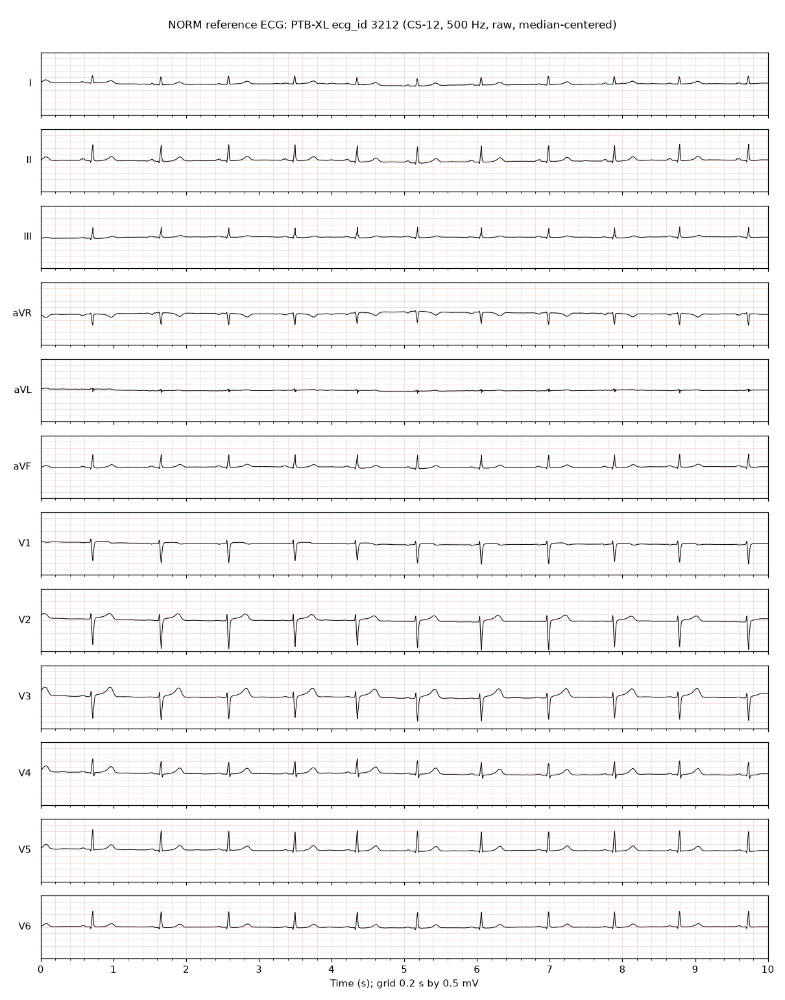

- ECG ID 3212, device CS-12, human validated: yes
- SCP codes: NORM 100, SR 0
- Report: "sinusrhythmus lagetyp normal normales ekg"

Is this a typical example of a normal ECG? yes / no / comment:

### 2. Myocardial infarction (MI, no other superclass)

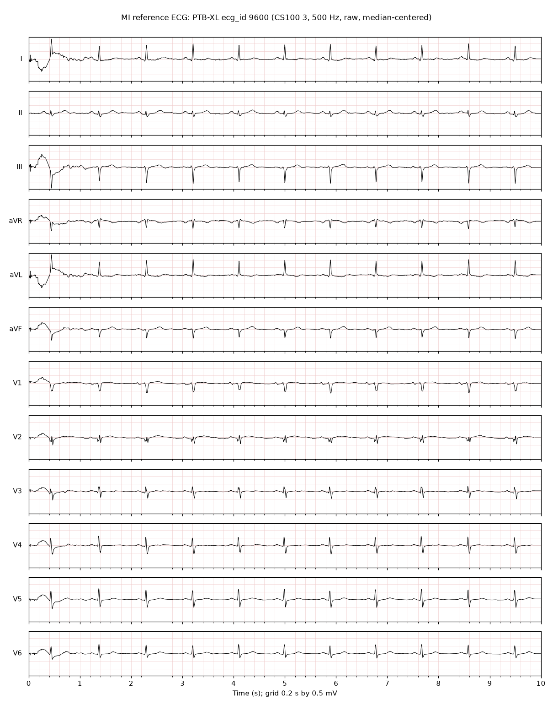

- ECG ID 9600, device CS100 3, human validated: yes
- SCP codes: IMI 100, ASMI 100, ABQRS 0, SR 0
- Report: "supraventrikuläre extrasystole(n) sinusrhythmus ueberdrehter linkstyp linksanteriorer
  hemiblock qrs(t) abnorm septaler infarkt nicht auszuschliessen inferiorer infarkt möglich t abnorm in
  hochlateralen ableitungen 4.46 unbestätigter bericht"
- Note: the first 0.5 s contains a large transient.

Is this a typical example of myocardial infarction? yes / no / comment:

### 3. ST/T change (STTC, no other superclass)

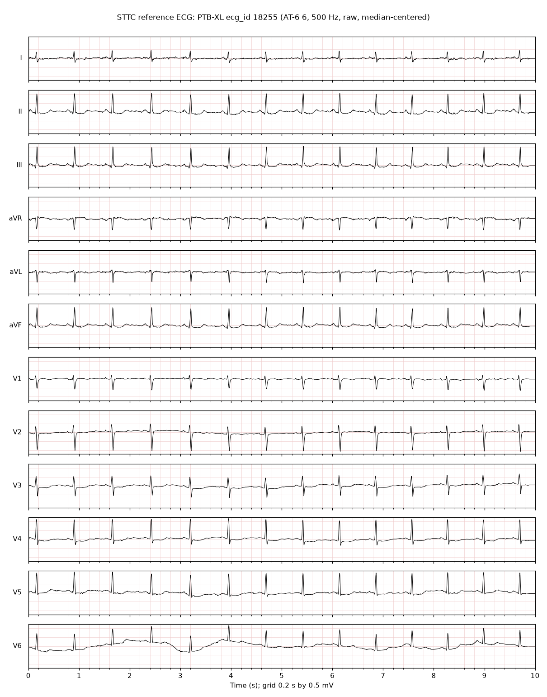

- ECG ID 18255, device AT-6 6, human validated: yes
- SCP codes: ISCAS 100, ISCIL 100, LOWT 0, STD_ 0, SR 0
- Report: "sinus rhythm. st segments are depressed in ii, iii, avf, v3-6. t waves are low or flat
  throughout. myocardial ischaemia is likely. the age of the changes is uncertain. suggest exclude
  hypokalaemia."

Is this a typical example of ST/T change? yes / no / comment:

### 4. Conduction disturbance (CD, no other superclass)

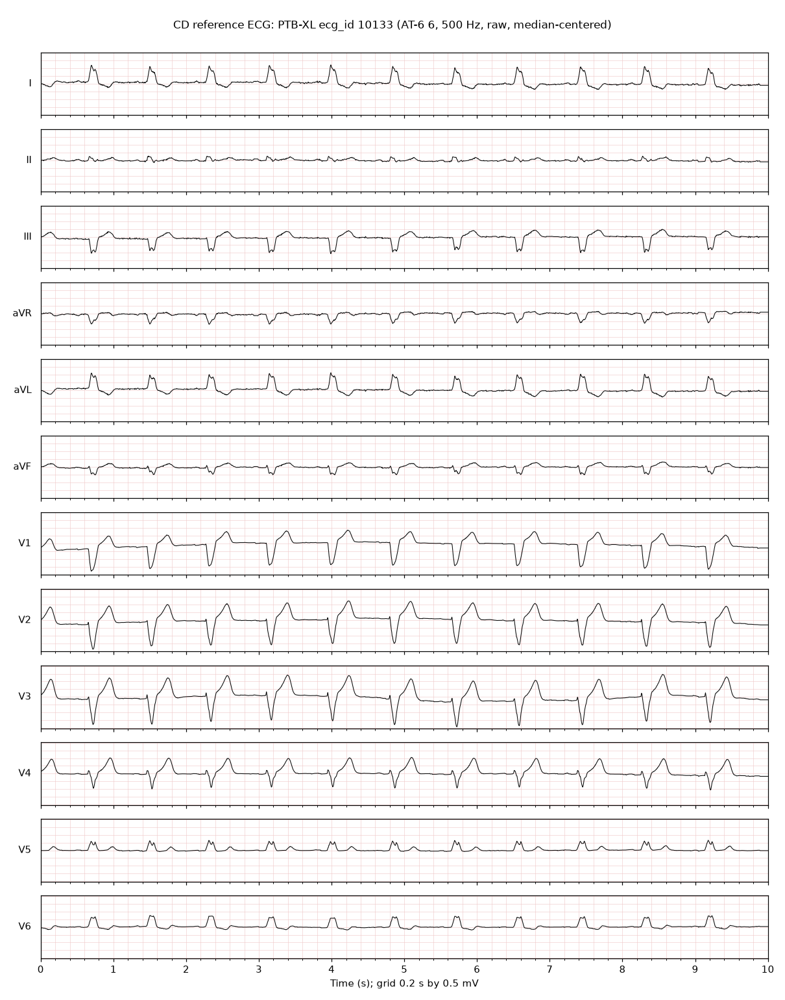

- ECG ID 10133, device AT-6 6, human validated: yes
- SCP codes: CLBBB 100, SR 0
- Report: "sinus rhythm. left bundle branch block, this is most commonly due to ischaemic heart disease."

Is this a typical example of conduction disturbance? yes / no / comment:

### 5. Hypertrophy (HYP, no other superclass)

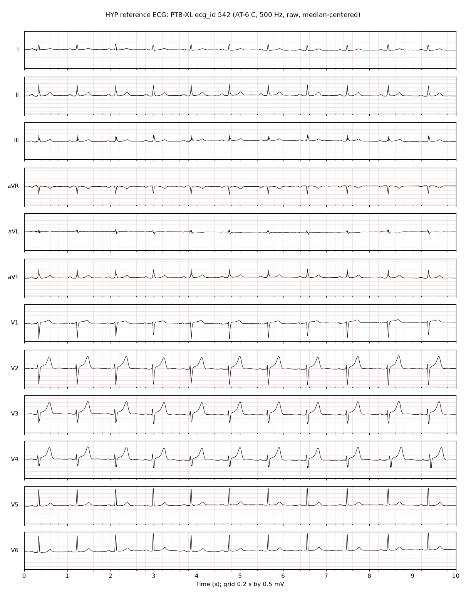

- ECG ID 542, device AT-6 C, human validated: yes
- SCP codes: LVH 100, SR 0
- Report: "sinusrytm måttliga amplitudkrit. för vänster kammarkhypertrofi ospecifik st-t förändring
  (höjning)"

Is this a typical example of hypertrophy? yes / no / comment:

## Part 2: possible label errors (20 questions)

For each ECG below, at least 80% of its 25 most similar training ECGs carry the opposite binary label, in
two different ECG models (CPC and ECG-JEPA). The binary label is "NORM only" (normal) versus "abnormal"
(any MI, STTC, CD or HYP statement, whatever its likelihood). Such ECGs may be mislabeled, borderline, or
simply unusual. These are the top 20 of 192 candidates, ordered by the average of the two fractions.

Each ECG below has its tracing, drawn the same way as in Part 1.

### 1. ECG 2410

- Current label: abnormal (CD); device CS-12 E; human validated: yes
- SCP codes: IRBBB 80, SR 0
- Neighbors with the other label: CPC 1.00, ECG-JEPA 1.00
- Report: "sinusrhythmus lagetyp normal unvollständiger rechtsschenkelblock sonst normales ekg"

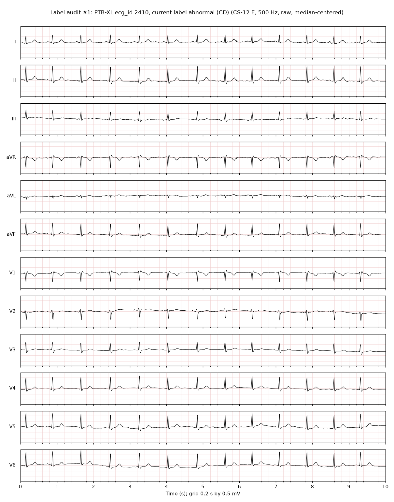

Is the current label correct? yes / no / comment:

### 2. ECG 9669

- Current label: NORM only; device CS100 3; human validated: no
- SCP codes: NORM 100, SR 0
- Neighbors with the other label: CPC 1.00, ECG-JEPA 1.00
- Report: "sinusrhythmus lagetyp normal lagetyp in anbetracht des alters normal normales ekg 4.46 unbestätigter bericht"

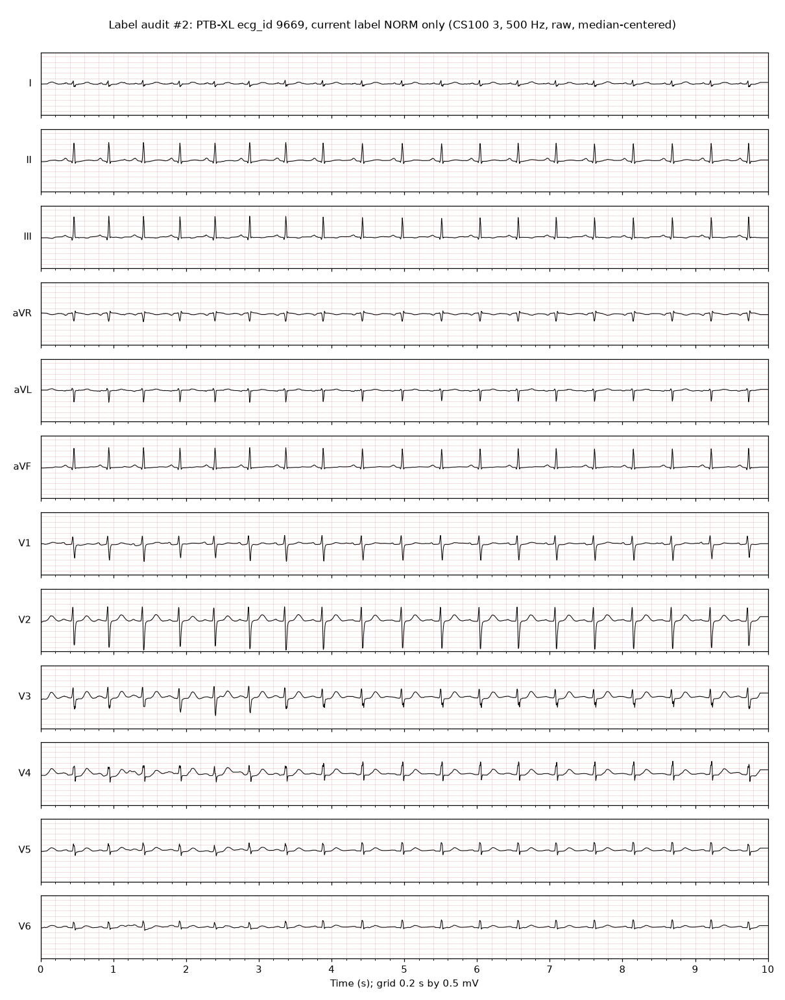

Is the current label correct? yes / no / comment:

### 3. ECG 12964

- Current label: NORM only; device AT-6 C 5.5; human validated: yes
- SCP codes: NORM 80, SR 0
- Neighbors with the other label: CPC 1.00, ECG-JEPA 1.00
- Report: "sinus rhythm. premature ventricular contractions, bigeminy. otherwise no definite pathology. the computer has selected vpb's as typical ventricular complexes because more of them have been recorded. please ignore this. Edit: BIGU"

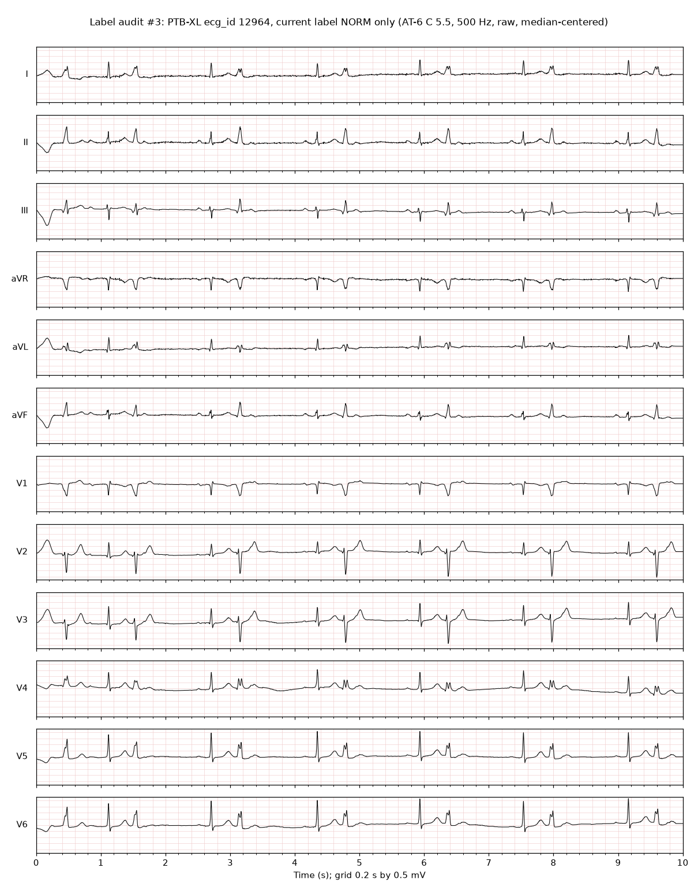

Is the current label correct? yes / no / comment:

### 4. ECG 2415

- Current label: abnormal (HYP); device CS-12 E; human validated: yes
- SCP codes: SEHYP 100, ABQRS 0, SR 0
- Neighbors with the other label: CPC 0.96, ECG-JEPA 1.00
- Report: "sinusrhythmus qrs(t) abnormal inferiorer myokardschaden nicht auszuschliessen"

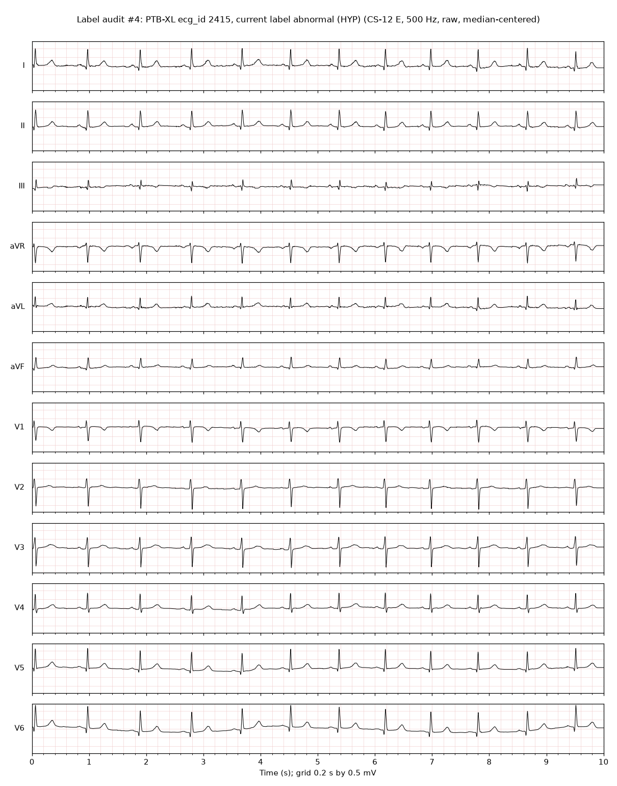

Is the current label correct? yes / no / comment:

### 5. ECG 7664

- Current label: abnormal (CD); device CS-12 E; human validated: yes
- SCP codes: IRBBB 100, SR 0
- Neighbors with the other label: CPC 1.00, ECG-JEPA 0.96
- Report: "sinusrhythmus lagetyp normal unvollständiger rechtsschenkelblock sonst normales ekg"

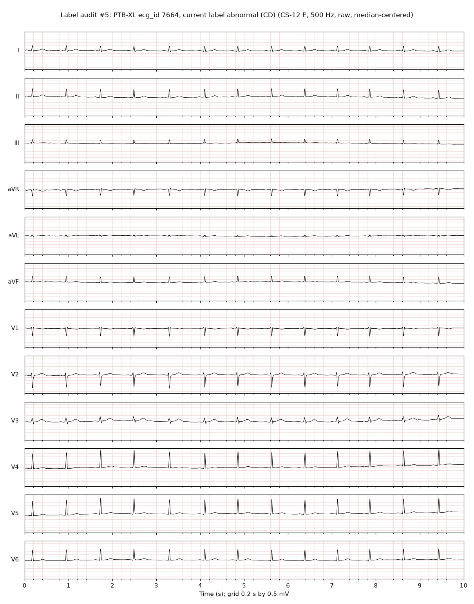

Is the current label correct? yes / no / comment:

### 6. ECG 14915

- Current label: abnormal (CD); device CS-12 E; human validated: yes
- SCP codes: IRBBB 100, SR 0
- Neighbors with the other label: CPC 0.96, ECG-JEPA 1.00
- Report: "sinusrhythmus lagetyp normal unvollständiger rechtsschenkelblock sonst normales ekg"

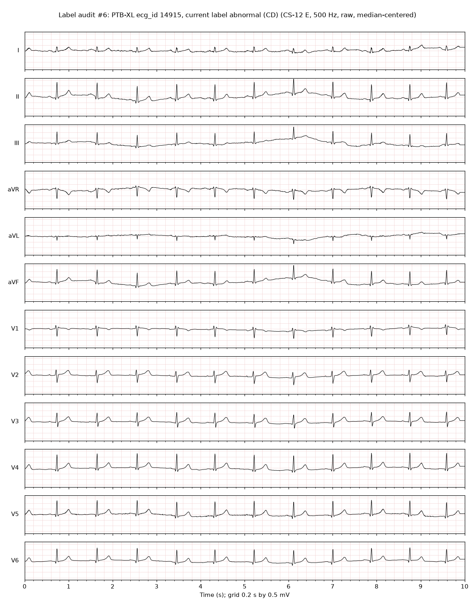

Is the current label correct? yes / no / comment:

### 7. ECG 17394

- Current label: abnormal (CD+MI); device CS-12; human validated: yes
- SCP codes: LMI 15, ASMI 50, IRBBB 100, ABQRS 0, SR 0
- Neighbors with the other label: CPC 1.00, ECG-JEPA 0.96
- Report: "sinusrhythmus lagetyp normal unvollständiger rechtsschenkelblock qrs(t) abnormal hochlateraler infarkt möglich"

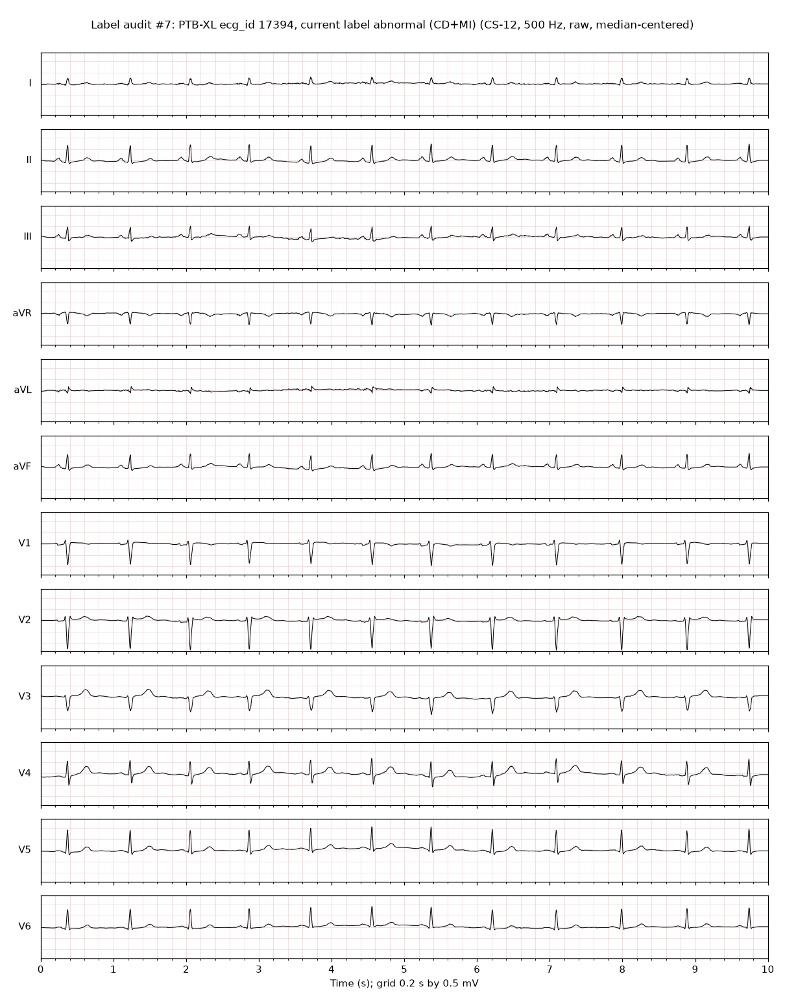

Is the current label correct? yes / no / comment:

### 8. ECG 17624

- Current label: NORM only; device AT-60 3; human validated: yes
- SCP codes: NORM 100, SR 0
- Neighbors with the other label: CPC 1.00, ECG-JEPA 0.96
- Report: "sinusrhythmus a-v block i verdacht auf p-sinistrocardiale linkstyp unspezifisches abnormes t qt-verlängerung 4.46 unbestätigter bericht"

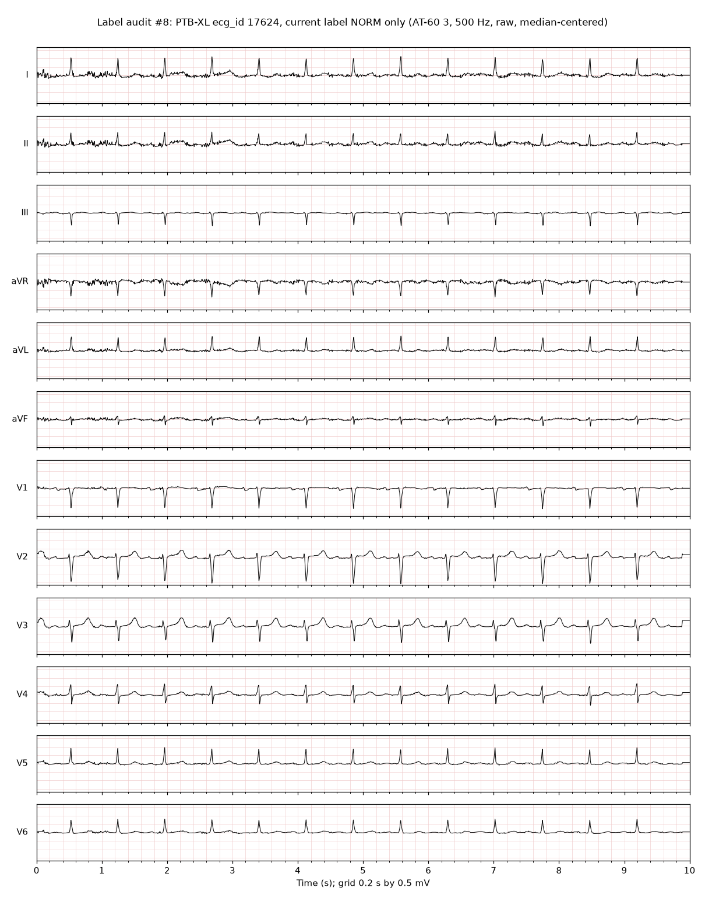

Is the current label correct? yes / no / comment:

### 9. ECG 17820

- Current label: NORM only; device AT-6 C 5.5; human validated: yes
- SCP codes: NORM 100, SR 0
- Neighbors with the other label: CPC 1.00, ECG-JEPA 0.96
- Report: "sinus rhythm. normal ecg."

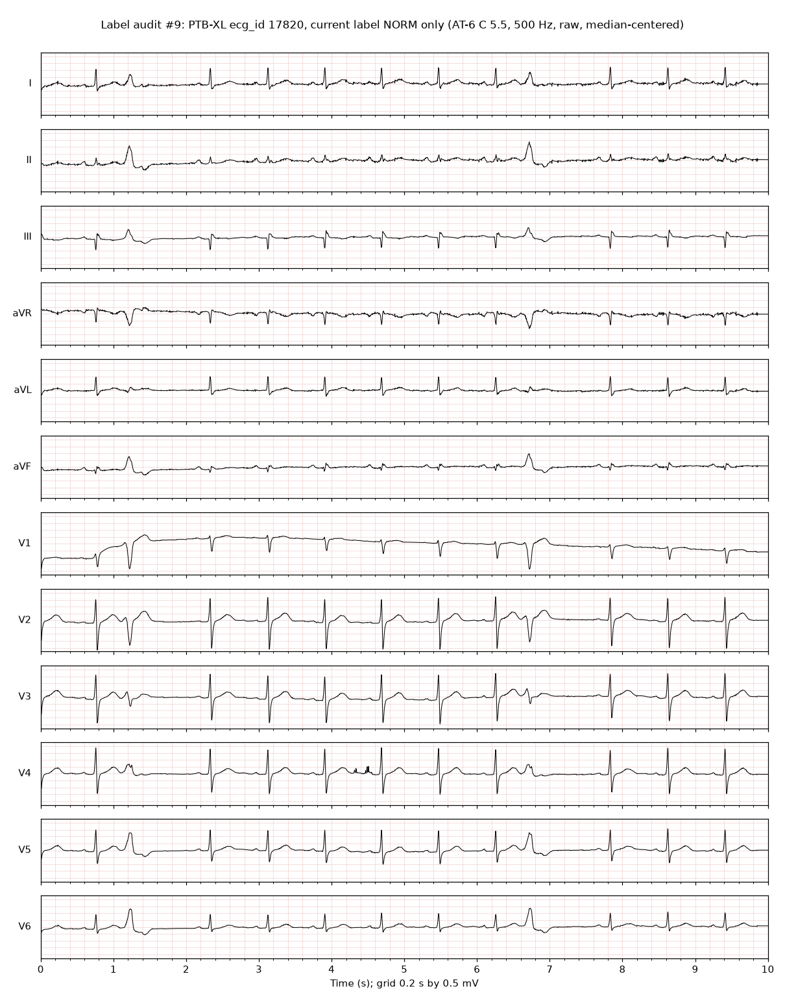

Is the current label correct? yes / no / comment:

### 10. ECG 131

- Current label: abnormal (MI); device CS-12 E; human validated: yes
- SCP codes: ASMI 50, ABQRS 0, SR 0
- Neighbors with the other label: CPC 0.96, ECG-JEPA 0.96
- Report: "sinusrhythmus qrs(t) abnormal septaler infarkt nicht auszuschliessen"

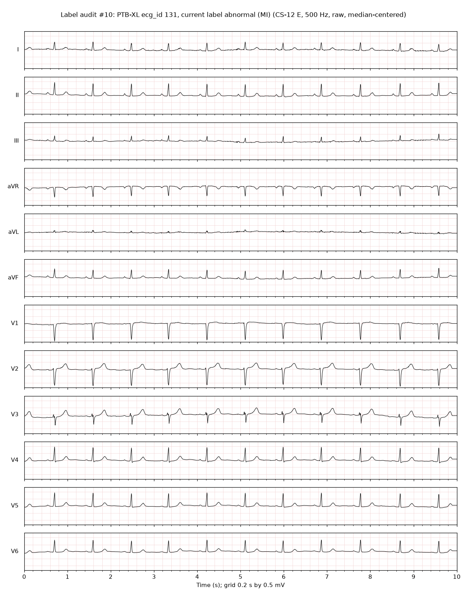

Is the current label correct? yes / no / comment:

### 11. ECG 1636

- Current label: NORM only; device AT-6 C 5.8; human validated: yes
- SCP codes: NORM 100, SR 0
- Neighbors with the other label: CPC 0.96, ECG-JEPA 0.96
- Report: "sinus rhythm. t waves are rather low. suggest exclude hypokalaemia. no paced beats recorded."

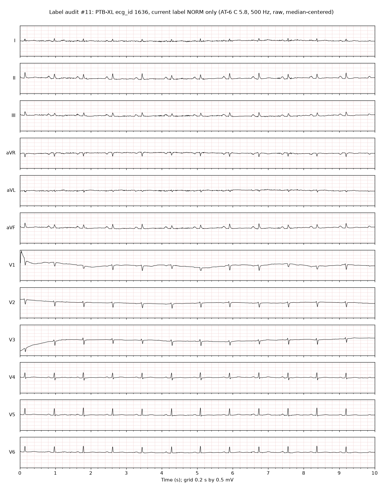

Is the current label correct? yes / no / comment:

### 12. ECG 4796

- Current label: abnormal (MI); device CS-12 E; human validated: yes
- SCP codes: ASMI 50, ABQRS 0, SR 0
- Neighbors with the other label: CPC 0.92, ECG-JEPA 1.00
- Report: "sinusrhythmus periphere niederspannung qrs(t) abnormal anteroseptaler infarkt wahrscheinlich alt"

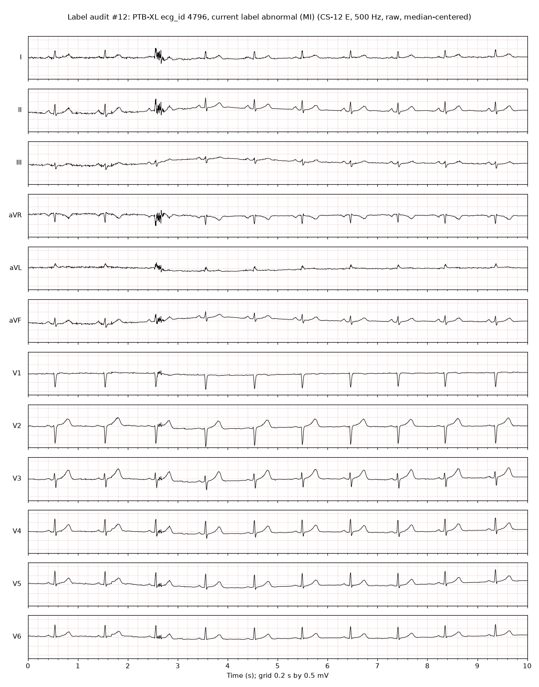

Is the current label correct? yes / no / comment:

### 13. ECG 10521

- Current label: abnormal (MI); device AT-6 C 5.3; human validated: yes
- SCP codes: ASMI 100, SR 0
- Neighbors with the other label: CPC 0.92, ECG-JEPA 1.00
- Report: "sinus rhythm. qs complexes in v2, this is probably normal. no definite pathology. Edit: ASMI 100, probably normal (f,30), QSV(1)-2, (ASMI 15)"

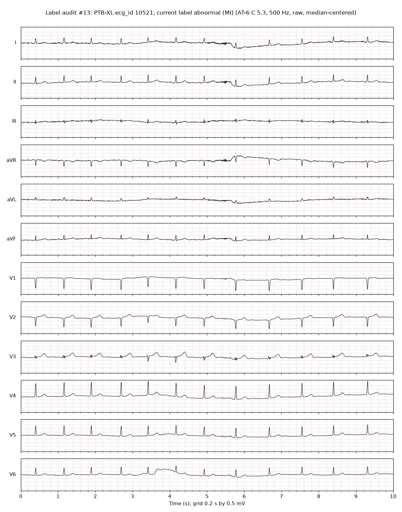

Is the current label correct? yes / no / comment:

### 14. ECG 10916

- Current label: abnormal (STTC); device CS100 3; human validated: no
- SCP codes: NDT 100, SR 0
- Neighbors with the other label: CPC 0.96, ECG-JEPA 0.96
- Report: "sinusrhythmus lagetyp normal periphere niederspannung 4.46 unbestätigter bericht"

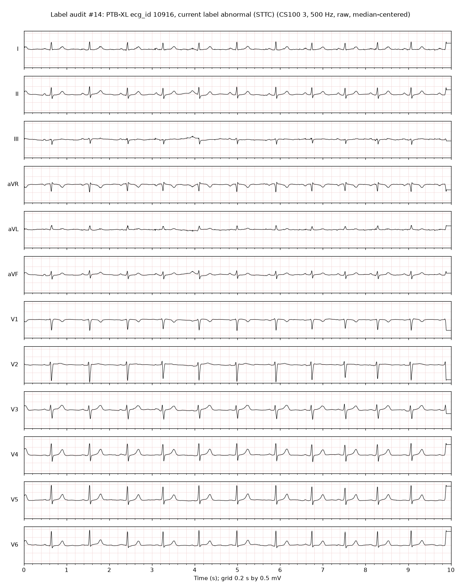

Is the current label correct? yes / no / comment:

### 15. ECG 12377

- Current label: abnormal (HYP); device CS100 3; human validated: no
- SCP codes: LVH 15, VCLVH 0, SR 0
- Neighbors with the other label: CPC 0.96, ECG-JEPA 0.96
- Report: "sinusrhythmus lagetyp normal mässige amplitudenkriterien für linkshypertrophie 4.46 unbestätigter bericht"

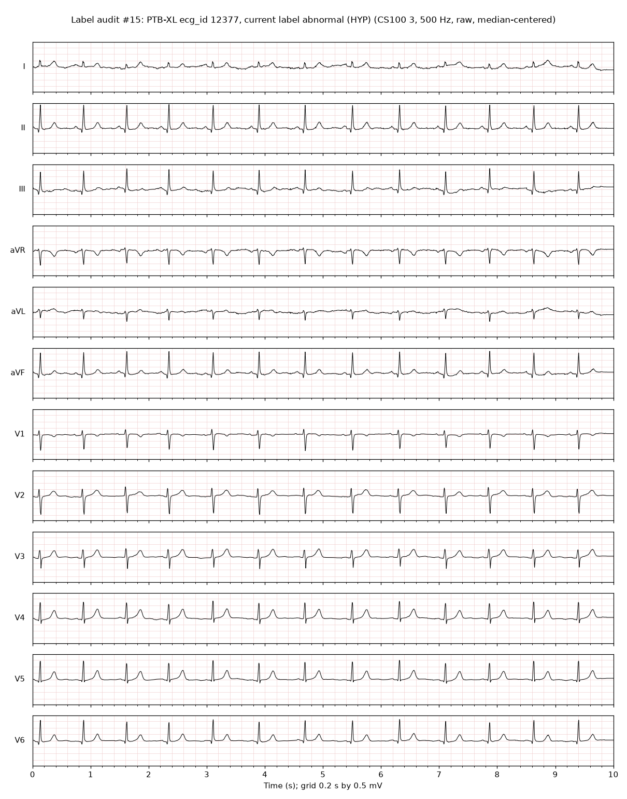

Is the current label correct? yes / no / comment:

### 16. ECG 17884

- Current label: abnormal (MI); device CS-12 E; human validated: yes
- SCP codes: AMI 100, ABQRS 0, SR 0
- Neighbors with the other label: CPC 0.96, ECG-JEPA 0.96
- Report: "sinusrhythmus lagetyp normal qrs(t) abnorm anteroseptaler myokardschaden nicht auszuschliessen"

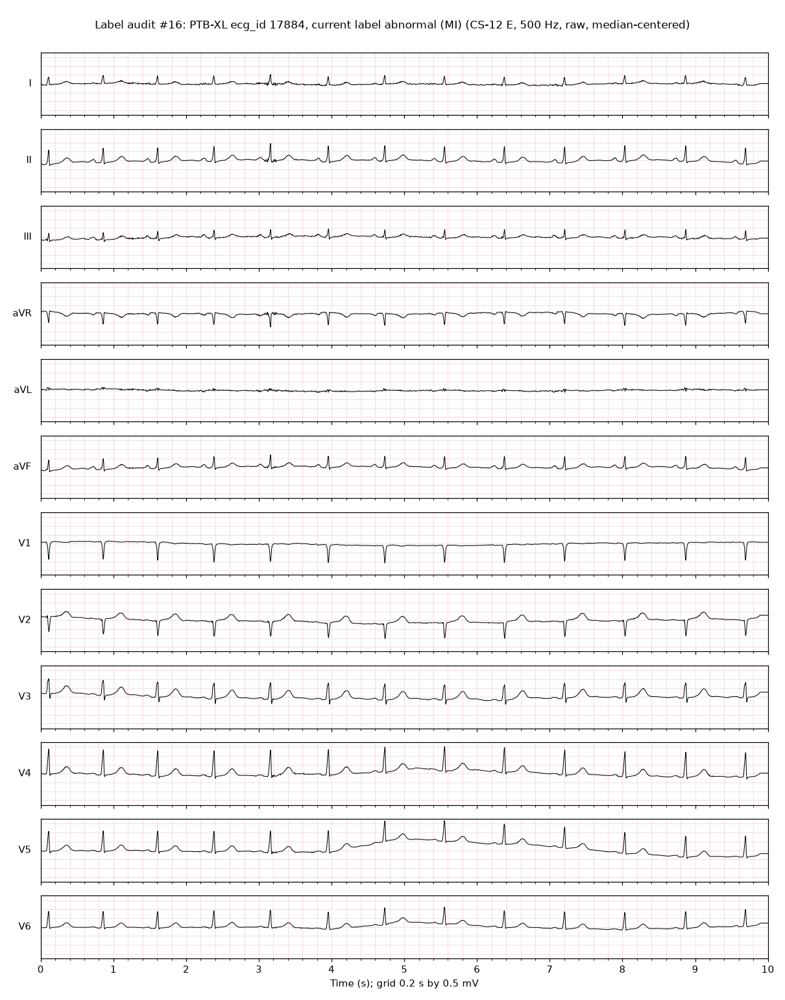

Is the current label correct? yes / no / comment:

### 17. ECG 21366

- Current label: NORM only; device CS100 3; human validated: no
- SCP codes: NORM 80, SR 0
- Neighbors with the other label: CPC 0.92, ECG-JEPA 1.00
- Report: "sinusrhythmus linkstyp sonst normales ekg 4.46 unbestätigter bericht"

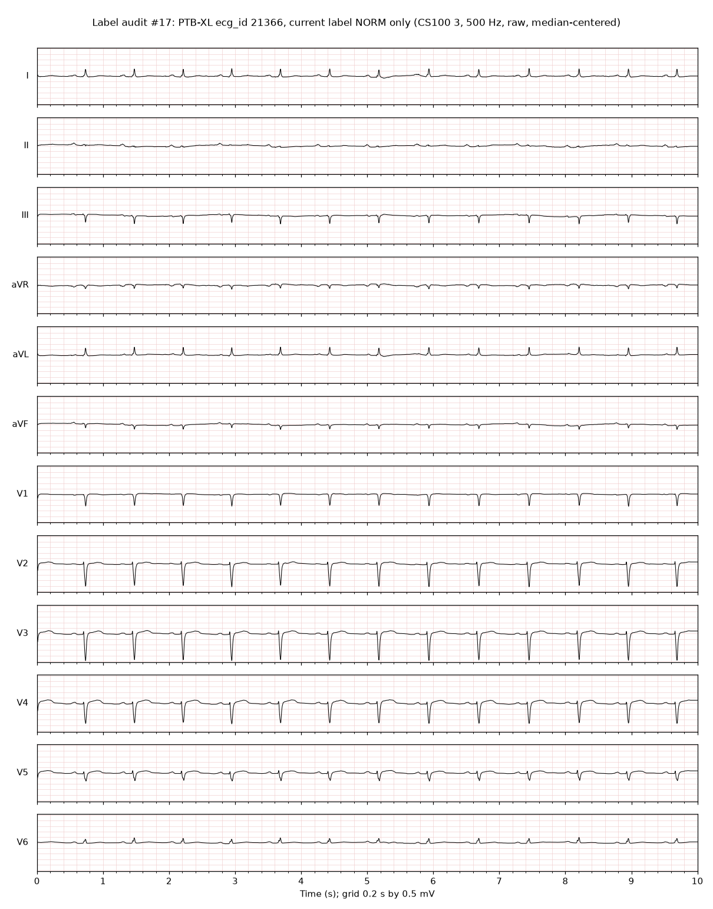

Is the current label correct? yes / no / comment:

### 18. ECG 2366

- Current label: abnormal (CD); device CS-12 E; human validated: yes
- SCP codes: IRBBB 100, ABQRS 0, SR 0
- Neighbors with the other label: CPC 0.92, ECG-JEPA 0.96
- Report: "sinusrhythmus lagetyp normal unvollständiger rechtsschenkelblock qrs(t) abnorm hochlateraler myokardschaden nicht auszuschliessen"

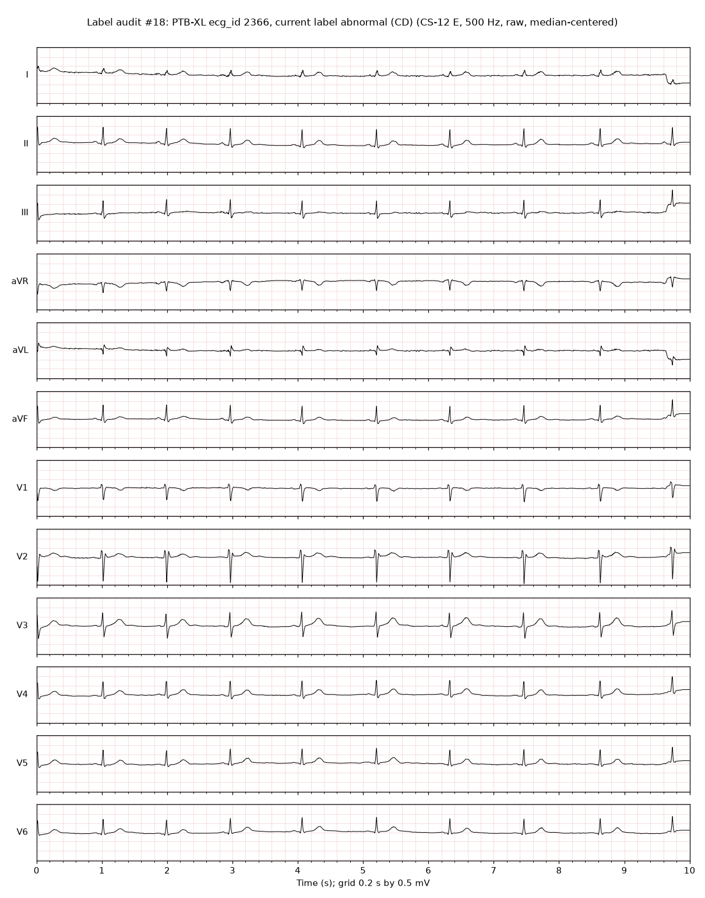

Is the current label correct? yes / no / comment:

### 19. ECG 2862

- Current label: abnormal (STTC); device CS-12 E; human validated: yes
- SCP codes: NDT 100, SARRH 0
- Neighbors with the other label: CPC 1.00, ECG-JEPA 0.88
- Report: "sinus arrhythmie verdacht auf p-sinistrocardiale lagetyp normal"

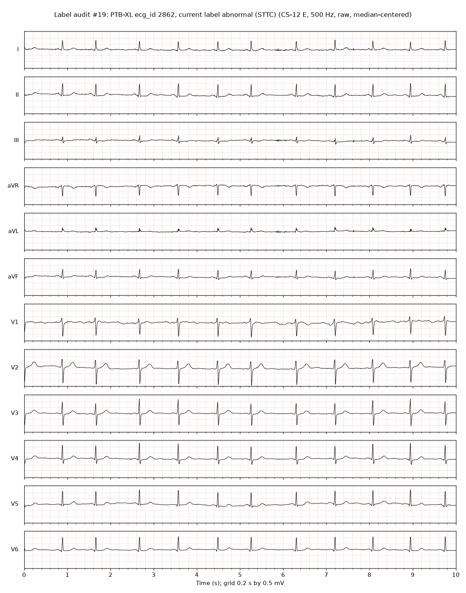

Is the current label correct? yes / no / comment:

### 20. ECG 4189

- Current label: abnormal (MI); device CS-12; human validated: yes
- SCP codes: IMI 15, ABQRS 0, SR 0
- Neighbors with the other label: CPC 0.88, ECG-JEPA 1.00
- Report: "sinusrhythmus lagetyp normal periphere niederspannung qrs(t) abnormal inferiorer myokardschaden nicht auszuschliessen"

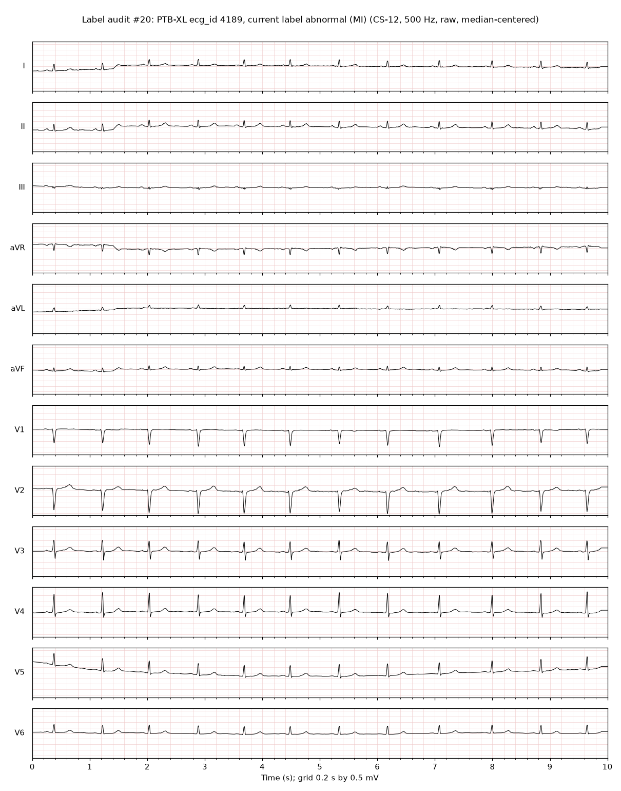

Is the current label correct? yes / no / comment:

## General comments

Anything else you noticed:

## SCP code legend

From PTB-XL `scp_statements.csv`.

- ABQRS: abnormal QRS
- AMI: anterior myocardial infarction
- ASMI: anteroseptal myocardial infarction
- CLBBB: (complete) left bundle branch block
- IMI: inferior myocardial infarction
- IRBBB: incomplete right bundle branch block
- ISCAS: ischemic ST-T changes in anteroseptal leads
- ISCIL: ischemic ST-T changes in inferolateral leads
- LMI: lateral myocardial infarction
- LOWT: low amplitude T-waves
- LVH: left ventricular hypertrophy
- NDT: non-diagnostic T abnormalities
- NORM: normal ECG
- SARRH: sinus arrhythmia
- SEHYP: septal hypertrophy
- SR: sinus rhythm
- STD_: non-specific ST depression
- VCLVH: voltage criteria (QRS) for left ventricular hypertrophy

The source data for this sheet are `outputs/experiment024_embedding_geometry_v1/medoids.csv` and
`label_audit.csv`; the results are in [experiment-024-embedding-geometry-results.md](experiment-024-embedding-geometry-results.md).
