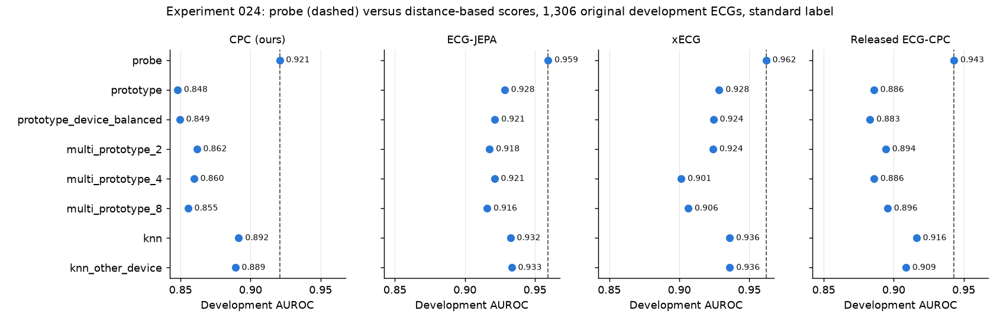

# Experiment 024 results: CPC embedding geometry audit and diagnosis prototypes

Completed 28 September 2026 under the [frozen protocol](experiment-024-embedding-geometry.md). Development
patients only; no calibration or test ECG was read, fitted or scored. CPU only, four BLAS threads, from
cached frozen features. Local outputs are in `outputs/experiment024_embedding_geometry_v1/` (`result.json`
with every input, source and protocol hash, `medoids.csv`, `label_audit.csv`, figures and `run.log`). The
figures are copied to [docs/figures/experiment-024/](figures/experiment-024/). A review sheet for a
cardiologist is in [experiment-024-clinician-review.md](experiment-024-clinician-review.md).

**Integrity.** The refitted `cpc_standard` head reproduced Experiment 020's development probabilities to
2.1e-6 (tolerance 1e-5) and its AUROC exactly (0.888642 on 1,572 ECGs). Every released cache matched its
extraction receipt. The run completed on the first attempt in 746 seconds.

**Rows.**

- CPC analyses: 17,417 training ECGs (17,083 with a standard label, 9,840 positive) and 1,604
  full-development ECGs from 1,438 patients (1,572 with a standard label, 884 positive, 1,413 patients).
- Encoder comparison and label audit: Experiment 025's pool of 15,359 training ECGs (13,351 patients,
  9,487 positive) and the 1,306 original development ECGs (1,173 patients, 843 positive). None dropped.

All intervals are 95% paired whole-patient bootstrap intervals (2,000 draws, seed 24024). No draw was
invalid in any contrast.

## 1. Prototype versus probe (primary)

Binary standard label, CPC, 1,572 full-development ECGs.

| Method | AUROC | Minus probe | 95% interval |
| --- | ---: | ---: | --- |
| `probe` | 0.889 | | |
| `prototype` | 0.812 | -0.077 | [-0.095, -0.060] |
| `prototype_device_balanced` | 0.820 | -0.069 | [-0.086, -0.052] |
| `multi_prototype_2` | 0.819 | -0.070 | [-0.086, -0.054] |
| `multi_prototype_4` | 0.813 | -0.076 | [-0.094, -0.059] |
| `multi_prototype_8` | 0.819 | -0.070 | [-0.085, -0.054] |
| `knn` (25 neighbors) | 0.855 | -0.034 | [-0.046, -0.022] |
| `knn_other_device` | 0.851 | -0.037 | [-0.050, -0.025] |

Primary statistic: `prototype` minus `probe` = **-0.077 [-0.095, -0.060]**.

Per superclass (task present versus NORM-only; development positives in parentheses):

| Task | Probe | Prototype | Prototype - probe [95% interval] | kNN | kNN other device | Best multi-prototype |
| --- | ---: | ---: | --- | ---: | ---: | ---: |
| MI (390) | 0.937 | 0.863 | -0.074 [-0.092, -0.056] | 0.908 | 0.902 | 0.883 (k = 2) |
| STTC (365) | 0.963 | 0.881 | -0.082 [-0.100, -0.066] | 0.924 | 0.923 | 0.890 (k = 8) |
| CD (384) | 0.914 | 0.841 | -0.072 [-0.095, -0.052] | 0.872 | 0.871 | 0.846 (k = 2) |
| HYP (181) | 0.912 | 0.811 | -0.101 [-0.132, -0.072] | 0.853 | 0.825 | 0.839 (k = 8) |

Per eligible subclass (15; development positives in parentheses):

| Subclass | Probe | Prototype | Prototype - probe [95% interval] | kNN |
| --- | ---: | ---: | --- | ---: |
| CLBBB (40) | 1.000 | 0.983 | -0.017 [-0.031, -0.007] | 0.998 |
| _AVB (64) | 0.991 | 0.971 | -0.020 [-0.035, -0.007] | 0.987 |
| CRBBB (37) | 1.000 | 0.970 | -0.030 [-0.055, -0.012] | 0.965 |
| LAO/LAE (32) | 0.938 | 0.891 | -0.047 [-0.088, -0.013] | 0.896 |
| ISCA (66) | 0.992 | 0.943 | -0.049 [-0.071, -0.031] | 0.961 |
| ISC_ (81) | 0.995 | 0.942 | -0.053 [-0.076, -0.034] | 0.972 |
| AMI (229) | 0.971 | 0.912 | -0.059 [-0.076, -0.043] | 0.939 |
| IVCD (54) | 0.900 | 0.833 | -0.066 [-0.112, -0.021] | 0.841 |
| ISCI (32) | 0.977 | 0.902 | -0.075 [-0.121, -0.039] | 0.819 |
| IMI (227) | 0.936 | 0.852 | -0.084 [-0.108, -0.061] | 0.893 |
| STTC (152) | 0.947 | 0.861 | -0.085 [-0.111, -0.060] | 0.890 |
| IRBBB (98) | 0.852 | 0.755 | -0.097 [-0.141, -0.054] | 0.750 |
| NST_ (52) | 0.933 | 0.833 | -0.100 [-0.143, -0.055] | 0.902 |
| LAFB/LPFB (144) | 0.957 | 0.851 | -0.106 [-0.138, -0.077] | 0.884 |
| LVH (136) | 0.925 | 0.811 | -0.114 [-0.149, -0.082] | 0.839 |

The prototype is below the probe for every task. Its interval excludes 0 for all 4 superclasses and all 15
subclasses. Only two subclasses, CLBBB and _AVB, have a gap of at most 0.02.

## 2. Nuisance audit

What the fixed probe (AUROC) and ridge regression (R²) recover from the CPC features, training to full
development (1,604 ECGs; age on the 1,570 with a known age):

| Target | Development score |
| --- | ---: |
| Device AT-60 3 | AUROC 0.960 |
| Device CS-12 E | AUROC 0.916 |
| Device AT-6 C | AUROC 0.812 |
| Device CS-12 | AUROC 0.809 |
| Device AT-6 6 | AUROC 0.790 |
| Device AT-6 C 5.8 | AUROC 0.782 |
| Device AT-6 C 5.5 | AUROC 0.747 |
| Sex | AUROC 0.875 |
| Age | R² 0.618 |
| Heart rate (EDA estimate) | R² 0.982 |

CS100 3 (49 development ECGs) is below the 50-ECG rule; Experiment 020 reported its probe AUROC as 0.974.

Neighborhoods: on average 29.2% of a development ECG's 25 nearest training ECGs come from its own device,
against an expected 13.0% from training shares. By device (queries with at least 40 ECGs):

| Query device | Queries | Same-device neighbors | Training share |
| --- | ---: | ---: | ---: |
| CS100 3 | 49 | 0.890 | 0.338 |
| CS-12 E | 330 | 0.428 | 0.116 |
| AT-6 C 5.5 | 297 | 0.322 | 0.184 |
| CS-12 | 441 | 0.275 | 0.157 |
| AT-6 6 | 165 | 0.221 | 0.105 |
| AT-60 3 | 132 | 0.092 | 0.035 |
| AT-6 C 5.8 | 53 | 0.087 | 0.039 |
| AT-6 C | 88 | 0.043 | 0.017 |

Controls on the binary label:

| Contrast | AUROC difference | 95% interval |
| --- | ---: | --- |
| `knn_other_device` - `knn` | -0.004 | [-0.010, +0.002] |
| `prototype_device_balanced` - `prototype` | +0.008 | [+0.001, +0.016] |

Excluding same-device neighbors barely changes kNN AUROC, although neighborhoods are enriched for the
query's device.

## 3. Structure

Adjusted mutual information of unsupervised partitions of the CPC training embeddings with each factor.
k-means on all 17,417 training ECGs; HDBSCAN on the 4,000-patient subset (PCA-16 explains 77.1% of the
variance).

| Partition | Superclass combination | Device | Sex | Age decade | Heart-rate band |
| --- | ---: | ---: | ---: | ---: | ---: |
| k-means, k = 2 | 0.014 | 0.008 | 0.004 | 0.014 | 0.237 |
| k-means, k = 4 | 0.058 | 0.228 | 0.014 | 0.040 | 0.157 |
| k-means, k = 8 | 0.070 | 0.230 | 0.016 | 0.072 | 0.228 |
| k-means, k = 16 | 0.089 | 0.221 | 0.017 | 0.079 | 0.252 |
| HDBSCAN | 0.037 | 0.013 | 0.006 | 0.023 | 0.311 |

Device AMI exceeds diagnosis AMI for k-means with k = 4, 8 and 16 (by 0.13 to 0.17). Diagnosis AMI is the
higher of the two for k = 2 and HDBSCAN, where both are small. The heart-rate band has the highest AMI in
three of the five partitions (k = 2, k = 16, HDBSCAN); for k = 4 and 8 device is highest. Several k-means
clusters are mostly one device: at k = 8, two clusters are 89% and 91% CS100 3. HDBSCAN left 2,688 of 4,000 ECGs unassigned
and found two clusters: 468 ECGs, 69% NORM-only, and 844 ECGs, 21% NORM-only.

## 4. Reference ECGs

Training ECGs most similar to each group prototype in the CPC space (full list in `medoids.csv`; one
figure per group in [docs/figures/experiment-024/](figures/experiment-024/)).

| Group (training ECGs) | Top ECG | Cosine to prototype | Its SCP codes | Devices of the top five |
| --- | ---: | ---: | --- | --- |
| NORM-only (7,243) | 3212 | 0.765 | NORM 100 | CS-12, AT-6 C 5.5, CS-12 E (3) |
| MI only (2,043) | 9600 | 0.795 | IMI 100, ASMI 100 | CS100 3 (5) |
| STTC only (1,903) | 18255 | 0.750 | ISCAS 100, ISCIL 100 | AT-6 6, CS-12, AT-60 3, AT-6 C 5.5, AT-6 C 5.8 |
| CD only (1,353) | 10133 | 0.821 | CLBBB 100 | AT-6 6 (2), CS100 3, CS-12, AT-6 C 5.5 |
| HYP only (415) | 542 | 0.750 | LVH 100 | AT-6 C, AT-6 C 5.5 (3), CS-12 |

All five MI reference ECGs come from the CS100 3 device, which records 34% of training ECGs. Four of them
were not validated by a human. The top MI record starts with a large transient in its first 0.5 s. All five
CD references carry CLBBB, and all five HYP references carry LVH.

## 5. Encoder comparison (secondary)

1,306 original development ECGs, standard label, 15,359-ECG training pool, each encoder in its own
pool-fitted space. CPC on these rows reproduces Experiment 025's N = all probe AUROC (0.921).

| Method | CPC | ECG-JEPA | xECG | Released ECG-CPC |
| --- | ---: | ---: | ---: | ---: |
| `probe` | 0.921 | 0.959 | 0.962 | 0.943 |
| `prototype` | 0.848 | 0.928 | 0.928 | 0.886 |
| `prototype_device_balanced` | 0.849 | 0.921 | 0.924 | 0.883 |
| `multi_prototype_2` | 0.862 | 0.918 | 0.924 | 0.894 |
| `multi_prototype_4` | 0.860 | 0.921 | 0.901 | 0.886 |
| `multi_prototype_8` | 0.855 | 0.916 | 0.906 | 0.896 |
| `knn` | 0.892 | 0.932 | 0.936 | 0.916 |
| `knn_other_device` | 0.889 | 0.933 | 0.936 | 0.909 |

| Contrast [95% interval] | CPC | ECG-JEPA | xECG | Released ECG-CPC |
| --- | --- | --- | --- | --- |
| `prototype` - `probe` | -0.073 [-0.090, -0.055] | -0.031 [-0.040, -0.023] | -0.034 [-0.043, -0.024] | -0.057 [-0.072, -0.044] |
| `knn_other_device` - `knn` | -0.003 [-0.008, +0.003] | +0.001 [-0.003, +0.005] | +0.000 [-0.004, +0.004] | -0.008 [-0.013, -0.002] |
| `prototype_device_balanced` - `prototype` | +0.002 [-0.006, +0.010] | -0.007 [-0.010, -0.004] | -0.004 [-0.007, -0.001] | -0.003 [-0.006, +0.000] |

Nuisance on the same rows:

| Target | CPC | ECG-JEPA | xECG | Released ECG-CPC |
| --- | ---: | ---: | ---: | ---: |
| Device AUROC, range over 6 devices | 0.744-0.950 | 0.769-0.935 | 0.749-0.939 | 0.803-0.950 |
| Sex AUROC | 0.872 | 0.911 | 0.929 | 0.909 |
| Age R² | 0.608 | 0.680 | 0.721 | 0.606 |
| Heart rate R² | 0.982 | 0.983 | 0.982 | 0.953 |
| Same-device neighbors (expected 0.128) | 0.290 | 0.226 | 0.208 | 0.279 |
| Same-device neighbors, CS100 3 queries (47) | 0.885 | 0.611 | 0.517 | 0.793 |



## 6. Label audit (training only)

Among the 15,359 pool ECGs, the fraction of the 25 nearest neighbors (self excluded) with the other standard
label averaged 0.257 in the CPC space and 0.196 in the ECG-JEPA space; the two fractions correlate at 0.74.
521 ECGs reach 0.8 in CPC, 481 in ECG-JEPA, and **192 in both**. These are the review candidates: 158
labeled positive and 34 labeled NORM-only. By superclass combination: MI 57, CD 41, NORM 34, HYP 31,
STTC 19, others 10. 76% of candidates were validated by a human, against 66% of the pool. The most
frequent devices are CS-12 E (56), CS100 3 (46) and CS-12 (39). Several of the top candidates are labeled
IRBBB alone, or MI with a low likelihood or a report saying "not excluded". `label_audit.csv` lists all
192; the top 20 are in the review sheet. No label was changed.

## Prespecified reading

- **Prototype versus probe.** The gap is 0.077 [0.060, 0.095], above 0.05. Under the protocol, diagnosis
  is linearly present in the CPC features but does not dominate their distances. Reference vectors and
  clustering would need a supervised projection first, such as the probe's subspace or metric learning.
  The gap is above 0.05 for every superclass and for 10 of the 15 subclasses.
- **Device.** The kNN criterion is not met: `knn_other_device` is 0.004 below `knn`, not more than 0.02.
  The AMI criterion is met for k-means with k = 4, 8 and 16, where device AMI (0.22-0.23) exceeds
  diagnosis AMI (0.06-0.09). It is not met for k = 2 or HDBSCAN. Because the rule is "either", the
  protocol's reading applies: device drives the partitions, and multi-source prototypes and clustering
  must be device- or source-controlled. Device does not measurably drive the kNN score.
- **Encoders.** The prototype-to-probe gap is 0.031 for ECG-JEPA and 0.034 for xECG, against 0.073 for
  CPC on the same rows; their intervals do not overlap CPC's. By the protocol's rule, ECG-JEPA or xECG is
  the better base for reference vectors and clustering. Their gaps are still above 0.02, which is in the
  intermediate range, so their prototypes are not usable as they are either. Released ECG-CPC's gap is
  0.057.

## Caveats

- The development patients were inspected by earlier experiments; every result is exploratory.
- Each encoder is one feature set (one checkpoint, preprocessing and pooling), and CPC is one seed.
- The heart rate is the EDA's QRS-energy screening estimate, not a clinical measurement. The R² of 0.98
  shows that the features encode something close to that estimate; it has not been checked against
  measured intervals.
- AMI compares partitions with coarse factors. Device, heart rate and diagnosis are correlated in PTB-XL,
  so a high AMI with one factor does not isolate it as a cause.
- The HDBSCAN result uses a 4,000-patient subset and left 67% of it unassigned.
- Reference ECGs are the members closest to a class mean. They are data-derived examples, not typical or
  textbook cases, and they have not been reviewed by a clinician.
- Label-audit candidates are ECGs whose neighbors disagree with their label. That can mean a wrong label,
  a borderline case, or a region where the embedding mixes diagnoses. It is not evidence of an error.
- The label is the PTB-XL standard superclass label, a diagnostic annotation proxy, not a clinical
  outcome.

## Reproduce

```bash
OMP_NUM_THREADS=4 uv run --no-sync python -m scripts.experiments.run_embedding_geometry024
```

The runner refuses to overwrite an existing `result.json`.
