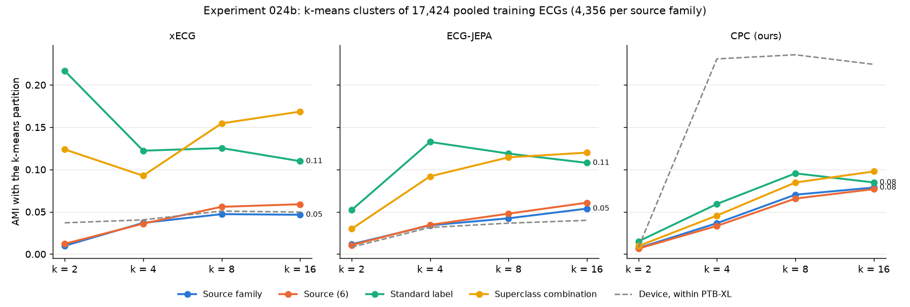
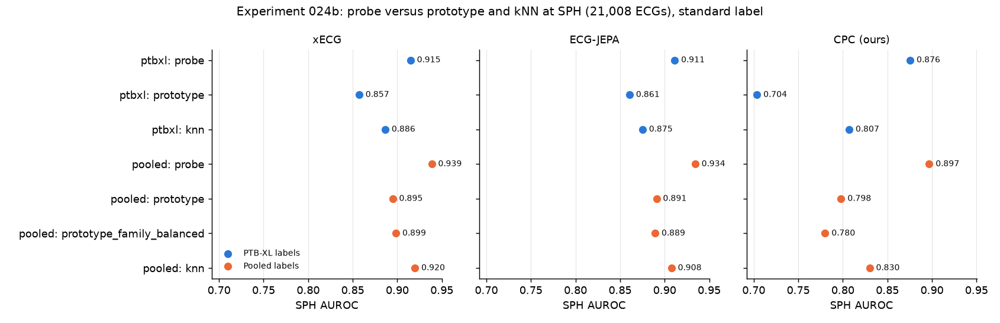

# Experiment 024b results: embedding geometry across hospitals

Completed 29 September 2026 under the [frozen protocol](experiment-024b-multisource-geometry.md) (frozen at
commit `1b82a68`, file SHA-256 `6509e61c…9a10`, recorded in the result). Run once at commit `8328d36` on CPU in
1,984 s: the 024 reproduction in the main process with four threads, then one process per encoder with one
thread each. The environment's `.venv` Python was called directly instead of through `uv run --no-sync`; it
is the same interpreter. Local outputs are in `outputs/experiment024b_multisource_geometry_v1/`
(`result.json` SHA-256 `c3298280…a275`, `medoids.csv`, figures, `run.log`); the figures are copied to
[docs/figures/experiment-024b/](figures/experiment-024b/). No Challenge test-group ECG and no PTB-XL
calibration or test ECG was read. This closes the backlog item `rerun_024_multisource`.

Before the run, a synthetic smoke test of the per-encoder code and a pass of the runner up to its count check
(no score computed) were used to catch errors.

## Integrity

- **024 reproduced exactly.** R1: the CPC k-means AMI with superclass combination and device matched 024 for
  k = 2, 4, 8, 16 (largest difference 0.0). R2: every method's AUROC in 024's encoder comparison matched for
  CPC, JEPA and xECG (difference 0.0), and the `prototype` minus `probe` intervals were identical. R3: the five
  CPC reference ECGs per group were the same records with the same similarities. 024's integrity check passed
  (probabilities within 2.1e-6, AUROC 0.888642).
- **022b reproduced exactly.** R4: the refitted `ptbxl` and `pooled` readouts gave 022b's SPH probabilities
  with a largest difference of 0.0 for all three encoders.
- Every count matched the protocol: 39,577 pooled training ECGs, the balanced draw of 4,356 per family
  (17,424), 9,184 held-out ECGs and 21,008 SPH ECGs. No bootstrap draw was skipped.

Intervals are 95% bootstrap intervals, 2,000 draws, seed 33033: by record for the balanced draw and the
held-out rows, by patient for SPH.

## 1. Structure: do clusters follow the hospital or the diagnosis? (primary)

AMI of k-means partitions of the balanced draw (4,356 ECGs from each of PTB-XL, Chapman/Ningbo, Georgia and
CPSC) with each factor:

| Encoder | k | Source family | Source (6) | Standard label | Superclass combination | Family minus label [95% interval] |
| --- | ---: | ---: | ---: | ---: | ---: | --- |
| xECG | 2 | 0.010 | 0.012 | 0.217 | 0.124 | -0.207 [-0.217, -0.196] |
| | 4 | 0.037 | 0.036 | 0.122 | 0.093 | -0.085 [-0.092, -0.078] |
| | **8** | **0.047** | 0.056 | **0.125** | 0.155 | **-0.078 [-0.084, -0.072]** |
| | 16 | 0.047 | 0.059 | 0.110 | 0.168 | -0.063 [-0.068, -0.058] |
| ECG-JEPA | 2 | 0.012 | 0.011 | 0.052 | 0.030 | -0.040 [-0.046, -0.035] |
| | 4 | 0.034 | 0.035 | 0.133 | 0.092 | -0.099 [-0.106, -0.091] |
| | 8 | 0.042 | 0.048 | 0.119 | 0.114 | -0.077 [-0.082, -0.070] |
| | 16 | 0.054 | 0.061 | 0.108 | 0.120 | -0.054 [-0.059, -0.048] |
| CPC | 2 | 0.007 | 0.007 | 0.015 | 0.010 | -0.008 [-0.011, -0.005] |
| | 4 | 0.037 | 0.033 | 0.059 | 0.046 | -0.023 [-0.028, -0.017] |
| | 8 | 0.070 | 0.066 | 0.095 | 0.085 | -0.025 [-0.031, -0.019] |
| | 16 | 0.079 | 0.077 | 0.085 | 0.098 | -0.006 [-0.011, -0.000] |

**Primary: xECG, k = 8, family AMI minus label AMI = -0.078 [-0.084, -0.072].**



Robustness, all prespecified:

- **Every one of the 36 robustness contrasts lies below 0**: three encoders, four k, and three contrasts
  (family minus standard label, family minus superclass combination, and the same in entropy explained). For
  CPC the gaps are small: -0.006 to -0.025 AMI.
- **Entropy explained** (fraction of each factor's entropy that the clusters account for, which does not
  depend on the number of levels): for xECG at k = 8, 0.059 of the family's entropy against 0.288 of the
  label's (difference -0.229 [-0.240, -0.217]).
- **Label held fixed.** Among negatives only, family AMI is 0.026 (xECG, k = 8), and 0.064 among positives,
  both below the label AMI of 0.125. The same holds for every partition except CPC at k = 16, where family AMI
  within each label (0.092, 0.097) slightly exceeds the label AMI (0.085).
- **Family held fixed.** The label AMI within a single family is 0.06-0.22 for xECG at k = 8 (Chapman/Ningbo
  0.216, PTB-XL 0.162, Georgia 0.105, CPSC 0.062).
- **HDBSCAN** (4,000 records, 1,000 per family, PCA-16) left 76-84% as noise and found two clusters for every
  encoder; family AMI 0.025-0.041, label AMI 0.066-0.078.

**Within PTB-XL alone** (17,083 training ECGs, each encoder's own scaler), k-means AMI with the device and the
standard label:

| Encoder | Device, k = 4 / 8 / 16 | Standard label, k = 4 / 8 / 16 |
| --- | --- | --- |
| xECG | 0.040 / 0.051 / 0.050 | 0.185 / 0.152 / 0.140 |
| ECG-JEPA | 0.031 / 0.037 / 0.040 | 0.125 / 0.136 / 0.118 |
| CPC | 0.231 / 0.236 / 0.224 | 0.067 / 0.072 / 0.076 |

The device-over-diagnosis pattern 024 found (0.22-0.23 against 0.06-0.09) is specific to our CPC encoder. The
released ECG-JEPA and xECG spaces, which 024 did not cluster, follow the label within PTB-XL too.

## 2. Prototype versus probe at SPH (secondary)

SPH AUROC (21,008 ECGs, 7,190 positive):

| Method | xECG, PTB-XL labels | xECG, pooled | JEPA, PTB-XL | JEPA, pooled | CPC, PTB-XL | CPC, pooled |
| --- | ---: | ---: | ---: | ---: | ---: | ---: |
| `probe` (022, 022b) | 0.915 | 0.939 | 0.911 | 0.934 | 0.876 | 0.897 |
| `prototype` | 0.857 | 0.895 | 0.861 | 0.891 | 0.704 | 0.798 |
| `prototype_family_balanced` | | 0.899 | | 0.889 | | 0.780 |
| `knn` (25) | 0.886 | 0.920 | 0.875 | 0.908 | 0.807 | 0.830 |

| Contrast [95% interval] | xECG | ECG-JEPA | CPC |
| --- | --- | --- | --- |
| `prototype` − `probe`, pooled labels | -0.044 [-0.047, -0.041] | -0.043 [-0.046, -0.041] | -0.099 [-0.104, -0.094] |
| `prototype` − `probe`, PTB-XL labels | -0.058 [-0.061, -0.054] | -0.051 [-0.054, -0.047] | -0.172 [-0.178, -0.166] |
| Change in the gap (pooled − PTB-XL) | +0.014 [+0.012, +0.016] | +0.007 [+0.005, +0.009] | +0.073 [+0.069, +0.077] |
| `prototype`, pooled − PTB-XL labels | +0.038 [+0.036, +0.039] | +0.030 [+0.028, +0.032] | +0.094 [+0.091, +0.098] |
| `prototype_family_balanced` − `prototype` | +0.004 [+0.003, +0.004] | -0.002 [-0.002, -0.001] | -0.018 [-0.019, -0.017] |
| `knn` − `probe`, pooled labels | -0.019 [-0.021, -0.016] | -0.027 [-0.029, -0.024] | -0.067 [-0.071, -0.063] |

Average precision shows the same pattern with larger gaps (xECG pooled prototype minus probe -0.068).



Pooled labels help prototypes more than they help the probe: the xECG prototype gains 0.038 at SPH, the probe
0.024. At SPH, an unseen hospital, the PTB-XL-only prototype gap (xECG -0.058, JEPA -0.051) is wider than in
PTB-XL development in 024 (-0.034, -0.031).

## 3. How much hospital signal do the encoders carry? (secondary)

The fixed logistic readout, fitted one family against the rest on the balanced draw, applied to held-out ECGs
(PTB-XL development 1,572; Challenge calibration groups 7,612):

| Encoder | Mean one-vs-rest AUROC, 4 families | Balanced accuracy, 4 families (chance 0.25) | Mean AUROC, 6 sources | Balanced accuracy, 6 sources (chance 0.17) |
| --- | --- | --- | --- | --- |
| xECG | 0.949 [0.946, 0.952] | 0.828 [0.819, 0.836] | 0.896 [0.893, 0.900] | 0.626 [0.616, 0.636] |
| ECG-JEPA | 0.939 [0.936, 0.942] | 0.807 [0.798, 0.816] | 0.890 [0.886, 0.894] | 0.608 [0.599, 0.618] |
| CPC | 0.925 [0.921, 0.928] | 0.766 [0.756, 0.776] | 0.873 [0.869, 0.877] | 0.555 [0.545, 0.565] |

Per family (xECG): PTB-XL 0.972, Georgia 0.953, Chapman/Ningbo 0.937, CPSC 0.934. The hardest sources to tell
apart are the ones inside a family: Chapman/Shaoxing 0.760 and Ningbo 0.856.

**Neighbors.** In the draw space, where each family is exactly a quarter of the pool, 41-58% of a held-out
ECG's 25 nearest neighbors come from its own family (xECG: PTB-XL 0.46, Chapman/Ningbo 0.50, CPSC 0.47,
Georgia 0.41). Taking the neighbors only from the other three families, which imitates a new site, costs
kNN AUROC:

| Held-out family | xECG `knn` → `knn_other_family` | JEPA | CPC |
| --- | --- | --- | --- |
| PTB-XL development | 0.886 → 0.845, -0.041 [-0.051, -0.032] | -0.081 [-0.095, -0.067] | -0.099 [-0.116, -0.082] |
| Chapman/Ningbo | 0.986 → 0.963, -0.023 [-0.026, -0.020] | -0.019 [-0.023, -0.016] | -0.072 [-0.080, -0.065] |
| Georgia | 0.926 → 0.914, -0.012 [-0.018, -0.007] | -0.016 [-0.023, -0.010] | -0.022 [-0.030, -0.013] |
| CPSC | 0.941 → 0.925, -0.016 [-0.026, -0.007] | -0.022 [-0.032, -0.012] | -0.027 [-0.040, -0.014] |

Every interval lies below 0. In 024, within PTB-XL, excluding the query's own device changed kNN AUROC by
only -0.008 to +0.001.

**Which hospital does SPH resemble?** Shares of SPH ECGs' 25 nearest draw ECGs: CPSC 0.39, Chapman/Ningbo
0.28, PTB-XL 0.23, Georgia 0.10 (xECG); for CPC, CPSC 0.53 and Chapman/Ningbo 0.08.

## 4. Reference ECGs: do the medoids come from one hospital? (secondary)

The 50 pooled training ECGs closest to each group prototype, in the pooled readout space:

| Group (pooled ECGs) | Group's family shares | xECG top 5 | xECG top 50 | Top 5 from one family (xECG, JEPA, CPC) |
| --- | --- | --- | --- | --- |
| NORM (12,217) | PTB-XL 0.59, Chapman/Ningbo 0.28 | PTB-XL 4, Chapman/Ningbo 1 | PTB-XL 35 | no, no, yes |
| MI (2,500) | PTB-XL 0.82, CPSC 0.18 | PTB-XL 5 | PTB-XL 48 | yes, yes, yes |
| STTC (11,226) | Chapman/Ningbo 0.54 | Chapman/Ningbo 5 | Chapman/Ningbo 49 | yes, yes, yes |
| CD (5,003) | Chapman/Ningbo 0.33, CPSC 0.29, PTB-XL 0.27 | mixed | CPSC 23, Chapman/Ningbo 18 | no, no, no |
| HYP (940) | Georgia 0.50, PTB-XL 0.44 | Georgia 3, PTB-XL 2 | PTB-XL 26, Georgia 24 | no, no, yes |

Post hoc (not prespecified), from the PTB-XL device of each medoid: **all five MI references are still
CS100 3 ECGs for every encoder**, as in 024, and 41-48 of the top 50 are. CS100 3 records 28% of PTB-XL.

The top xECG references (figures in [docs/figures/experiment-024b/](figures/experiment-024b/)): NORM PTB-XL
9820 (CS-12 E, NORM, validated by a human); MI PTB-XL 5155 (CS100 3, IMI, not validated); STTC Ningbo
JS17604 (coded atrial flutter and T-wave abnormality); CD CPSC 2018 A2705 (right bundle branch block); HYP
Georgia E01909 (left ventricular hypertrophy). None has been reviewed by a clinician.

## Prespecified reading

- **Primary: the clusters follow the diagnosis more than the hospital.** xECG, k = 8: family AMI minus label
  AMI is -0.078 [-0.084, -0.072], entirely below 0 and larger than the 0.02 "small" line. Every robustness
  contrast agrees in sign. For CPC the difference is small at every k (at most 0.025).
- **Prototypes still trail the probe.** With pooled labels the gap at SPH is 0.044 (xECG) and 0.043 (JEPA),
  in 024's intermediate range (0.02-0.05), and 0.099 for CPC (above 0.05: diagnosis does not dominate CPC's
  distances). **Pooling narrows the gap** for every encoder (intervals above 0), most for CPC.
- **Hospital signal is strong but secondary.** A linear readout names the source family at a mean AUROC of
  0.925-0.949, neighborhoods are about twice as rich in the query's own hospital as its share, and removing
  those neighbors costs kNN 0.012-0.099 AUROC. The coarse cluster structure is not organized by it.
- **Medoids:** the MI and STTC references each come from one hospital for all three encoders, which is also
  where most of their group lives; NORM, CD and HYP references are mixed for xECG and JEPA.

## What this means for the student deployment

- A new university is a new source. Its ECGs will not form their own large cluster: at the cluster level the
  released encoders sort ECGs by normal versus abnormal more than by hospital. Clustering pooled data is not
  mainly clustering hospitals.
- But hospital is written into the embeddings clearly enough that a linear readout names it 83% of the time
  among four families, and close neighbors are mostly from the same hospital. A method that leans on nearest
  neighbors or on a hospital-specific boundary will lose accuracy at a site it has never seen: kNN without
  same-hospital neighbors loses 0.01-0.04 AUROC for xECG, and the PTB-XL-only prototype loses more at SPH than
  at home. This matches 022b and 027b: rankings transfer reasonably, thresholds and local structure do not.
- For reference vectors per condition, pooled labels are better than PTB-XL alone, but prototypes are still
  0.04 AUROC behind a linear probe for xECG and JEPA. The screen should stay on the supervised probe; a
  per-condition reference ECG is a visual aid, not a classifier, and some come from one hospital or one device.
- CPC's geometry is dominated by the PTB-XL device (024's finding) far more than by hospital, and its
  prototypes are poor. This adds to the case for xECG or JEPA as the base.

## Surprises

- The expected result was the opposite. 024's device finding and the high source identifiability suggested
  hospitals would dominate the clusters; they do not, for any encoder. At k = 8 and 16 the clusters account for
  only 5-8% of the source family's entropy, against 28-32% of the label's (xECG, JEPA).
- The released encoders do not show 024's device pattern even within PTB-XL (device AMI 0.03-0.05). The
  device effect was a property of our CPC encoder.
- The two sources inside the Chapman/Ningbo family are hard to tell apart (Chapman/Shaoxing AUROC 0.76),
  while four hospitals on three continents are easy to tell apart; the combined release behaves like one site.
- SPH, a Chinese hospital, neighbors CPSC (another Chinese collection) most, not Chapman/Ningbo, although the
  Chinese family dominates the pooled training data.
- Removing same-hospital neighbors hurts PTB-XL queries most (-0.041 to -0.099), even though PTB-XL
  development patients are disjoint from training, while the record-split Challenge families lose less.

## Caveats

- ECG-JEPA and xECG were pretrained without labels on Chapman and Ningbo waveforms; CPC has seen no Challenge
  record. The primary answer is the same for all three.
- The family carries more than the hospital: country, device, protocol, population and labeling practice.
  The Challenge negative (sinus rhythm alone) is stricter than PTB-XL's NORM, and the positive share differs
  by family (57-87%), so label and family are not independent; the fixed-label AMI is the check on that.
- AMI compares a partition with coarse factors and depends on their number of levels; the entropy-explained
  fraction and the superclass combination agree with it here.
- The Challenge split is by record, so a patient can appear in training and in the calibration group. This can
  inflate same-family neighbors, `knn` and the source probe for the Challenge families; the PTB-XL
  development rows are patient-disjoint.
- One balanced draw, one k-means seed, one checkpoint per encoder; intervals hold the partitions and fits fixed.
  HDBSCAN left most records as noise. PTB-XL development was inspected by earlier experiments.
- The medoid device breakdown is post hoc. Reference ECGs are data-derived examples, not typical cases, and
  have not been reviewed by a clinician. The label is an ECG annotation proxy, not confirmed disease.

## Reproduce

```bash
PYTHONPATH=. OMP_NUM_THREADS=4 uv run --no-sync python -u -m scripts.experiments.run_multisource_geometry024b
```

The runner refuses to overwrite an existing `result.json`.
