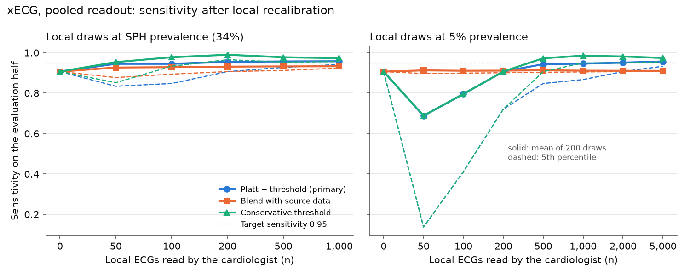
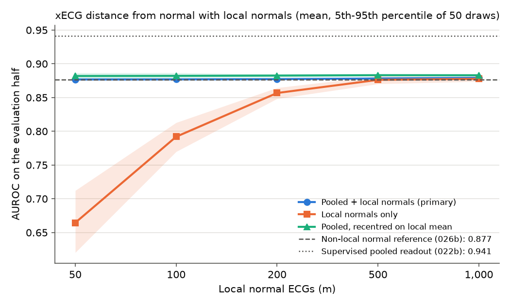

# Experiment 029 results: local adaptation at a new site

Completed 29 September 2026 under the [frozen protocol](experiment-029-local-adaptation.md) (frozen at commit
`a52b72d`, whose file hash the run recorded). Run once at commit `9f9bcd0` on CPU in 1,420 s, three encoder
processes with one thread each. Local outputs are in `outputs/experiment029_local_adaptation_v1/`
(`result.json` SHA-256 `c8593349…36ae`, `split.csv`, `part_a_draws.csv`, `part_b_draws.csv`, `run.log`). No
Challenge test-group ECG, no PTB-XL test ECG and no PTB-XL calibration ECG as a test was read. This covers
the backlog items `site_recalibration` and `local_normal_manifold`.

Before the run, one pass with 3 and 1 draws per size was made into a scratch directory to check the code and
timing. Its scores were not read and its outputs were deleted.

**SPH is no longer untouched.** Experiments 022, 022b, 024b, 026, 026b, 027 and 027b have all read it. This
is a simulation of a new site, not a final test.

## Integrity

- The split matched the protocol: evaluation half 10,479 ECGs (10,181 patients, 3,584 positive), local pool
  10,529 (10,183 patients, 3,606 positive); no patient in both.
- The six source operating points (Platt fits, thresholds and SPH calibrated probabilities of the `pooled`
  and `ptbxl` readouts) reproduced 022b exactly (largest difference 0.0).
- The rebuilt 10,846-normal reference reproduced 026b's saved SPH `pooled` scores exactly for all three
  encoders (0.0).
- `platt_threshold` and `threshold_only` referred exactly the same evaluation ECGs in every one of the 6,000
  site draws, as the protocol expected. They differ only in the probability shown and, at 5% prevalence, in
  a few fallbacks.
- At SPH prevalence no draw fell back. At 5% prevalence, 114 `threshold_only` and 137 `platt_threshold` draws
  (of 8,400 each, all heads) had no local positive or a single class and kept the source point.
- 27 `platt_threshold` site draws (almost all at n = 50) gave some calibrated probabilities of exactly 0 or 1,
  where the calibration intercept and slope are undefined. They are left out of those two means only. The
  protocol did not foresee this; it affects no sensitivity or specificity.

## Part A: recalibrating the operating point

### Primary: xECG, pooled readout, Platt plus threshold

Evaluation half, 200 draws per n. "Share" is the share of draws with sensitivity at least 0.95. Referrals are
per 1,000 ECGs at an assumed 5% prevalence.

| n | Local positives, mean (5th pct) | Share | Sensitivity, mean (5th pct) | Specificity, mean (5th pct) | Referrals at 5% |
| ---: | ---: | ---: | --- | --- | ---: |
| 0 (022b) | - | 0.00 | 0.907 | 0.797 | 239 |
| 50 | 17 (12) | 0.61 | 0.945 (0.834) | 0.552 (0.100) | 473 |
| 100 | 34 (27) | 0.53 | 0.945 (0.848) | 0.606 (0.215) | 421 |
| 200 | 69 (58) | 0.67 | 0.955 (0.907) | 0.602 (0.379) | 426 |
| 500 | 171 (154) | 0.70 | 0.957 (0.927) | 0.611 (0.453) | 417 |
| 1,000 | 342 (322) | 0.79 | 0.958 (0.942) | 0.615 (0.512) | 413 |

**Answer to (A): not reached by 1,000.** The largest share is 0.79, at n = 1,000. Local recalibration moves
the mean sensitivity from 0.907 to about 0.95, as intended. But the standard rule puts the threshold at the
local sample's own 5th percentile of positives, so roughly one draw in three still lands below 0.95. More
local ECGs only narrow the spread.

The price of reaching 95% is specificity. At the source threshold the readout passed 80% of SPH normals; at a
locally fitted 95% threshold it passes about 61%.

### All options, xECG pooled readout

Share of draws reaching 0.95 (smallest n with share at least 0.90 in bold):

| Option | n = 50 | 100 | 200 | 500 | 1,000 | Specificity at 1,000 |
| --- | ---: | ---: | ---: | ---: | ---: | ---: |
| `platt_threshold` (primary) | 0.61 | 0.53 | 0.67 | 0.70 | 0.79 | 0.615 |
| `threshold_only` | 0.61 | 0.53 | 0.67 | 0.70 | 0.79 | 0.615 |
| `blend` | 0.24 | 0.14 | 0.07 | 0.04 | 0.01 | 0.729 |
| `conservative` | 0.69 | 0.87 | **1.00** | 0.98 | 1.00 | 0.507 |

- **`conservative` meets the criterion from n = 200** (share 0.995). This is the distribution-free rule that
  was added before any score: it picks the r-th lowest local positive so that 95% sensitivity holds with 90%
  confidence. It needs at least 45 local positives. Below that it falls back to the lowest positive, which
  is why n = 200 (about 69 positives, the lowest one) is so strict: specificity 0.251. At n = 1,000 it keeps
  0.995 of draws at 0.95 or more with specificity 0.507 (mean sensitivity 0.973).
- **`blend` does not work.** Half the weight stays on the source hospitals, and the threshold ends up between
  the two sites: sensitivity about 0.93 at every n, so the share falls towards 0 as n grows.
- **Same pattern for JEPA and CPC.** For `platt_threshold` the largest shares are 0.80 (JEPA) and 0.685 (CPC)
  at n = 1,000; `conservative` meets the criterion from n = 200 for both (0.985 and 0.975). CPC's
  specificity at a local 95% point is lower (0.454 at n = 1,000, against 0.598 for JEPA and 0.615 for xECG).
- **The PTB-XL-only readout** behaves as the order-statistic argument in the protocol predicts: with
  `platt_threshold` its share stays near one half at every n (0.49-0.54 for xECG). Its specificity at a local
  95% point is lower than the pooled readout's (0.527 against 0.615 for xECG at n = 1,000), which matches
  022b's better ranking for the pooled readout. The one "success" of `blend` (PTB-XL CPC, from n = 500) comes
  from a source threshold that already overshot (sensitivity 0.969, specificity 0.293), not from adaptation.

### Probabilities: local Platt fixes calibration quickly

xECG pooled readout, evaluation half, mean over draws:

| Mapping | Brier | ECE (10 bins) | Calibration intercept | Calibration slope |
| --- | ---: | ---: | ---: | ---: |
| Source (022b, n = 0) | 0.122 | 0.151 | −1.59 | 0.93 |
| Local Platt, n = 50 | 0.089 | 0.047 | +0.10 | 1.05 |
| Local Platt, n = 100 | 0.085 | 0.031 | +0.01 | 1.01 |
| Local Platt, n = 200 | 0.084 | 0.023 | −0.04 | 1.04 |
| Local Platt, n = 1,000 | 0.083 | 0.012 | −0.03 | 1.04 |
| Blend, n = 1,000 | 0.089 | 0.056 | −0.62 | 0.99 |

The shown probability is almost fully recalibrated with 100 local ECGs: the intercept goes from −1.59 (the
source probabilities were much too high for SPH) to about 0. The same holds for every head (intercepts
within ±0.1 from n = 100).

### Low prevalence: local draws at 5% positives

The same draws with the local sample forced to a 5% positive share (Binomial number of positives), scored on
the same evaluation half. xECG pooled readout:

| n | Local positives, mean (5th pct) | Share, `platt_threshold` | Share, `conservative` | Specificity, `conservative` | Referrals at 5%, `conservative` |
| ---: | ---: | ---: | ---: | ---: | ---: |
| 50 | 2.3 (0) | 0.17 | 0.18 | 0.843 | 339 |
| 100 | 5.0 (2) | 0.21 | 0.21 | 0.798 | 405 |
| 200 | 9.7 (4) | 0.46 | 0.46 | 0.637 | 549 |
| 500 | 25 (17) | 0.55 | 0.84 | 0.406 | 724 |
| 1,000 | 50 (39) | 0.53 | **0.95** | 0.297 | 799 |
| 2,000 | 101 (86) | 0.56 | 0.94 | 0.376 | 746 |
| 5,000 | 251 (232) | 0.76 | 0.99 | 0.493 | 667 |

- With the standard rule, even 5,000 local ECGs (about 250 positives) give 95% sensitivity in only 76% of
  draws. With a handful of positives (n up to 200) the threshold is set by 2-10 positives and mean
  sensitivity falls to 0.69-0.91, below the source point.
- `conservative` reaches the criterion at n = 1,000 (share 0.945; 77% of those draws had the 45 positives it
  needs), but at a heavy cost: specificity 0.30, about 800 referrals per 1,000. It becomes usable only at
  n = 5,000 (specificity 0.49).
- What matters is the number of **positives**, not of ECGs: the SPH-prevalence draws with about 69 positives
  (n = 200) and the 5% draws with about 50-100 positives (n = 1,000-2,000) behave alike.
- JEPA and CPC give the same picture (`conservative` from n = 1,000 for all heads; `platt_threshold` never).

*xECG, pooled readout. At 5% prevalence the primary and conservative means coincide up to n = 200, where
fewer than 45 positives force both to the same cut.*

## Part B: a local normal reference

xECG, evaluation half, 50 draws per m. The non-local reference (026b pooled) scores AUROC 0.877; 026's
PTB-XL-only reference 0.856; the supervised pooled readout 0.941.

| m | `local_plus_pooled` (primary) AUROC, mean | Share beating 0.877 | Gain | `local_only` AUROC, mean (5th-95th) | `recentered` AUROC, mean | `recentered` gain |
| ---: | ---: | ---: | ---: | --- | ---: | ---: |
| 50 | 0.877 | 0.96 | +0.0002 | 0.665 (0.620-0.712) | 0.882 | +0.005 |
| 100 | 0.877 | 1.00 | +0.0003 | 0.792 (0.770-0.813) | 0.882 | +0.006 |
| 200 | 0.877 | 1.00 | +0.0007 | 0.857 (0.848-0.865) | 0.883 | +0.006 |
| 500 | 0.878 | 1.00 | +0.0017 | 0.876 (0.870-0.882) | 0.883 | +0.007 |
| 1,000 | 0.879 | 1.00 | +0.0027 | 0.878 (0.874-0.881) | 0.883 | +0.007 |

**Answer to (B): m = 50, but the gain is negligible.** Adding 50 local normals to the 10,846 non-local ones
beats the non-local reference in 96% of draws, and 100 or more in every draw. The gain is +0.0002 AUROC at 50
and +0.003 at 1,000, below the 0.005 line at every m. The local normals are 0.5-8% of the fit set and barely
move it.

- **`recentered` does better with the same normals:** shifting SPH features so the local normal mean sits on
  the reference mean gives +0.005 at m = 50 and +0.007 from m = 500 (share above 0.90 from m = 50). Only a
  mean is estimated, so 100-200 normals are enough.
- **`local_only` needs about 500-1,000 normals** just to match the non-local reference for xECG (0.876 at 500,
  0.878 at 1,000). With 50 normals (12 components) it is poor (0.665).
- **JEPA and CPC gain more.** JEPA: `local_only` 0.877 at m = 1,000 (+0.012 over its non-local 0.865),
  `recentered` +0.008-0.009 from m = 50, `local_plus_pooled` +0.006 at 1,000. CPC: `recentered` +0.017 from
  m = 50, `local_only` and `local_plus_pooled` +0.012 at 1,000. Their non-local references were weaker (0.865
  and 0.804), so there was more to recover.
- **No option closes the gap to the supervised readout.** The best distance-from-normal score is 0.883
  (xECG `recentered`), against 0.941 for the supervised pooled readout on the same evaluation half.

## Prespecified reading

- **(A):** for xECG, the pooled readout and Platt plus threshold, no n up to 1,000 reaches 95% sensitivity
  in at least 90% of draws (largest share 0.79 at 1,000). The pre-registered conservative threshold does,
  from n = 200 at SPH's prevalence and from n = 1,000 at 5% prevalence, at a cost in specificity.
- **(B):** m = 50 local normals added to the pooled reference beat the non-local reference in at least 90% of
  draws (96%), but the gain is negligible in practice at every m (at most +0.003).
- The evaluation half is fixed, so the shares describe the variability of the local sample only. Its own
  sampling error on a sensitivity near 0.95 is about ±0.007. The pooled readout's mean sensitivity at
  n = 1,000 (0.958) sits slightly above the 0.95 the rule targets, while the PTB-XL readout's (0.949) does
  not; this is most likely a chance difference between the two halves of this one split, which the draws
  cannot show.

## What this means for the student pilot

- **Labeled ECGs for the threshold.** The cardiologist must read enough ECGs to contain **at least about 50
  abnormal ones**; below 45 no rule can promise 95% sensitivity with 90% confidence. At SPH's 34% that is
  about 200 ECGs. At a student prevalence near 5% it is about 1,000 ECGs, and nearer 5,000 for a threshold
  that is not very strict. If the true student prevalence is 1-2%, the number grows in proportion. An
  enriched sample (adding known abnormal ECGs, for example referred students) would reach 50 positives far
  sooner, but those positives must look like the site's positives.
- **Use the conservative rule, not the plain 95% rule.** The plain rule hits 95% only about two times in
  three, however many ECGs are read. The conservative rule keeps 95% in 19 of 20 simulated pilots, but refers
  more: at SPH, about 50% of normals (specificity 0.51) with 1,000 local ECGs.
- **Expect many referrals.** Even with the best readout and a local threshold, 95% sensitivity at SPH passed
  only about 61% of normals. At 5% prevalence that is about 410 referrals per 1,000 students (plain rule) or
  520 (conservative rule). Students are healthier than SPH patients, so specificity may be higher, but that
  is untested. The referral rate may matter more than the pilot size.
- **Probabilities are cheap to fix.** 100 cardiologist-read ECGs are enough to recalibrate the shown risk
  (intercept from −1.6 to about 0).
- **Normal ECGs for the normal reference.** 100-200 local normal ECGs are enough for the recentred
  reference (+0.005-0.007 AUROC for xECG, more for JEPA and CPC). A local-only reference needs about 1,000.
  Local normals do not make the distance-from-normal score competitive with the supervised readout (0.883
  against 0.941), so they are a secondary use of the pilot. Normal student ECGs are easy to collect, since
  most students will be normal.
- **Caveats.**
  - Low prevalence changes everything: the positives, not the ECGs, set the pilot size.
  - A different device and filtering than SPH's (and than the readout's training hospitals).
  - Young people: normal young ECGs differ (higher voltages, early repolarization) and may be over-referred.
  - The cardiologist's reads are the label, and may differ from SPH's AHA codes.
  - Here the local pool and the evaluation half come from the same hospital and period, the most favourable
    case. A drift between the pilot and later use would need a recheck.

## Surprises

- The blend of source and local data, the natural compromise, was the worst option for the threshold: it
  never reached 95% more often than the local-only fit, and less often as n grew.
- The last few points of sensitivity are expensive at SPH: going from the source point (0.907 sensitivity,
  0.797 specificity) to a local 95% point costs about 0.18 of specificity (0.95 with about 0.61).
- For the normal reference, one mean vector (`recentered`) beat refitting the whole reference on the pooled
  plus local normals, at every m and for every encoder.

## Caveats

- SPH has been read by several earlier experiments; this is a simulation, not a final test.
- SPH is an older Chinese hospital cohort at 34% prevalence, heavily band-pass filtered; the label is an ECG
  annotation proxy, not confirmed disease or a referral decision.
- One patient split. The draws vary the local sample; the split itself and the evaluation half are fixed.
- Readouts, encoders and references are one fit each. No age or other subgroup analysis was done.
