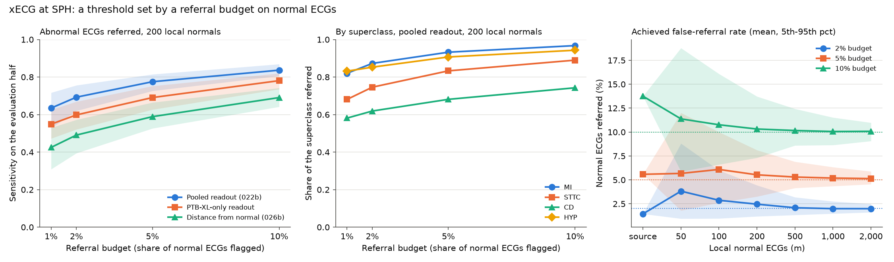

# Experiment 030 results: an operating point set by a referral budget

Completed 29 September 2026 under the [frozen protocol](experiment-030-referral-budget.md) (frozen at commit
`ab6c4e6`, whose file hash the run recorded). Run once at commit `6f7a41f` on CPU in 6 s, one process with at
most four threads. Local outputs are in `outputs/experiment030_referral_budget_v1/` (`result.json` SHA-256
`b20c7b1c…0056`, `draws.csv`, `families.csv`, `run.log`). No Challenge test-group ECG, no PTB-XL test ECG and
no PTB-XL calibration ECG as a test was read. This covers the backlog item `referral_budget_operating_point`.

Before the run, one pass with 3 draws and 20 bootstrap resamples was made into a scratch directory to check
the code. Its output was discarded unread (only the row counts were checked) and deleted.

**SPH is development data now.** Experiments 022, 022b, 024b, 026, 026b, 027, 027b and 029 have all read it.
This is a simulation of a new site, not a final test.

## Integrity

- 029's split reproduced exactly (evaluation half 10,479 ECGs, 3,584 positive, 6,895 normal; local pool
  6,923 normals), and every input matched its receipt.
- Source normals: 1,923 for the supervised readouts, 1,707 for the distance-from-normal score, as the
  protocol fixed.
- The per-ECG referral shares used by the bootstrap reproduced every draw-averaged sensitivity to 1e-9.

## Primary: xECG, pooled readout

Evaluation half, 200 draws per m. "Rate" is the share of evaluation normals referred (the achieved
false-referral rate): mean, with the 5th-95th percentile across draws. "Within ±1 pp" is the share of draws
whose rate is within 1 percentage point of the budget. Sensitivity is the mean over draws, with its 95%
patient-bootstrap interval.

| Budget | m | Rate | Within ±1 pp | Sensitivity [95% CI] | 5th-95th pct across draws |
| --- | ---: | --- | ---: | --- | --- |
| 1% | source | 0.59% | 1.00 | 0.559 [0.542, 0.575] | - |
| | 200 | 1.47% (0.55-2.82) | 0.81 | 0.635 [0.620, 0.649] | 0.528-0.717 |
| | 1,000 | 1.15% (0.84-1.60) | 1.00 | 0.617 [0.601, 0.632] | 0.580-0.659 |
| 2% | source | 1.45% | 1.00 | 0.646 [0.630, 0.661] | - |
| | 200 | 2.46% (1.19-4.44) | 0.71 | 0.693 [0.678, 0.706] | 0.620-0.756 |
| | 1,000 | 2.00% (1.48-2.76) | 0.97 | 0.680 [0.665, 0.695] | 0.650-0.716 |
| 5% | source | 5.58% | 1.00 | 0.781 [0.767, 0.794] | - |
| | 50 | 5.68% (1.80-12.01) | 0.25 | 0.767 [0.755, 0.779] | 0.672-0.854 |
| | 100 | 6.09% (2.62-10.00) | 0.32 | 0.781 [0.768, 0.793] | 0.712-0.833 |
| | 200 | 5.53% (3.26-8.12) | 0.52 | **0.775 [0.762, 0.787]** | 0.726-0.815 |
| | 500 | 5.30% (4.15-6.91) | 0.78 | 0.773 [0.760, 0.786] | 0.751-0.800 |
| | 1,000 | 5.19% (4.35-6.34) | 0.89 | 0.772 [0.759, 0.785] | 0.755-0.793 |
| | 2,000 | 5.13% (4.55-5.89) | 0.96 | 0.771 [0.758, 0.784] | 0.759-0.787 |
| 10% | source | 13.75% | 0.00 | 0.869 [0.858, 0.880] | - |
| | 200 | 10.32% (7.31-13.72) | 0.40 | 0.837 [0.825, 0.848] | 0.806-0.869 |
| | 1,000 | 10.06% (8.64-11.52) | 0.74 | 0.835 [0.823, 0.847] | 0.818-0.852 |
| | 2,000 | 10.08% (9.06-10.98) | 0.94 | 0.835 [0.823, 0.847] | 0.824-0.846 |

**Answer to (A): not reached by 1,000.** At a 5% budget, the achieved rate is within 4-6% in 89% of draws
with 1,000 local normals (just under the 90% line) and in 96% with 2,000. This is what the pre-registered
Beta calculation predicted (0.85 at 1,000, 0.96 at 2,000). With 200 normals, one pilot in two lands outside
4-6% (range 3.3-8.1%).

**Answer to (B): sensitivity 0.775 [0.762, 0.787] at a 5% budget with 200 local normals.** Across draws it
ranges 0.726-0.815. It barely depends on m: the local sample moves the rate, and sensitivity follows the rate,
but the mean sensitivity is 0.767-0.781 at every m.

**Answer to (C), secondary.**

- **2% budget:** the ±1 pp criterion is met from m = 500 (0.90; 0.97 at 1,000). Sensitivity with 200 local
  normals 0.693 [0.678, 0.706].
- **10% budget:** not reached by 1,000 (0.74; 0.94 at 2,000). Sensitivity with 200 local normals 0.837
  [0.825, 0.848].
- **1% budget:** from m = 500 (0.97). Sensitivity with 200 local normals 0.635 [0.620, 0.649]. ±1 pp is
  loose here; within ±0.5 pp needs 1,000 normals (0.93).

A ±1 pp band is a relative band of ±20% at 5% and ±10% at 10%, which is why the larger budget needs more
normals.

### By superclass

xECG pooled readout, 200 local normals, share of each superclass referred, mean [95% patient-bootstrap CI]:

| Budget | MI (122) | STTC (2,507) | CD (1,184) | HYP (117) | All abnormal |
| --- | --- | --- | --- | --- | --- |
| 1% | 0.820 [0.758, 0.880] | 0.681 [0.664, 0.697] | 0.581 [0.552, 0.609] | 0.831 [0.758, 0.892] | 0.635 |
| 2% | 0.873 [0.819, 0.924] | 0.746 [0.731, 0.761] | 0.619 [0.591, 0.646] | 0.853 [0.784, 0.910] | 0.693 |
| 5% | 0.932 [0.890, 0.972] | 0.833 [0.819, 0.846] | 0.681 [0.655, 0.707] | 0.907 [0.851, 0.953] | 0.775 |
| 10% | 0.967 [0.939, 0.992] | 0.890 [0.878, 0.901] | 0.743 [0.718, 0.766] | 0.943 [0.899, 0.979] | 0.837 |

MI and HYP are caught most often (about 0.93 and 0.91 at 5%), STTC in between, and conduction disturbances
least (0.68 at 5%, 0.74 at 10%). The misses concentrate in CD. At SPH, CD mixes minor findings (for example
right bundle branch block or first-degree AV block) with major ones; the athlete criteria treat several of
the minor ones as normal, so part of this gap may not matter for students. The superclass mix was not split
further (no subgroup analysis beyond the four superclasses).

## Other scores and encoders

With 200 local normals, sensitivity at each budget (95% CI half-widths are about ±0.015):

| Score | Encoder | 1% | 2% | 5% | 10% |
| --- | --- | ---: | ---: | ---: | ---: |
| Pooled readout (022b) | xECG | 0.635 | 0.693 | 0.775 | 0.837 |
| | JEPA | 0.623 | 0.679 | 0.764 | 0.832 |
| | CPC | 0.479 | 0.543 | 0.641 | 0.730 |
| PTB-XL-only readout | xECG | 0.549 | 0.598 | 0.691 | 0.781 |
| | JEPA | 0.552 | 0.597 | 0.691 | 0.774 |
| | CPC | 0.433 | 0.486 | 0.581 | 0.675 |
| Distance from normal (026b) | xECG | 0.425 | 0.491 | 0.589 | 0.691 |
| | JEPA | 0.426 | 0.487 | 0.582 | 0.677 |
| | CPC | 0.350 | 0.394 | 0.480 | 0.572 |

Paired contrasts at a 5% budget and m = 200 (sensitivity difference [95% CI]):

- Pooled minus PTB-XL-only readout, xECG: +0.084 [+0.075, +0.095]. The multi-hospital readout's better
  ranking (022b) turns into 8 more abnormal ECGs caught per 100 at the same referral budget.
- Pooled readout minus distance from normal, xECG: +0.186 [+0.173, +0.199]. The unsupervised score is far
  behind at every budget.
- xECG minus JEPA: +0.011 [+0.004, +0.018]; xECG minus CPC: +0.134 [+0.122, +0.145].
- 200 local normals minus the source quantile: −0.006 [−0.008, −0.003] in sensitivity and −0.05 pp
  [−0.20, +0.09] in rate. For this one head the source quantile happened to be right at SPH (below).

The ±1 pp criterion at a 5% budget is not met by 1,000 normals for any score. JEPA's pooled readout stays at
0.57-0.62 up to 2,000 normals: its mean rate settles at 5.8%, not 5%. Post hoc, the 5% threshold from all
6,923 pool normals gives 5.77% on the evaluation normals for JEPA (5.05% for xECG, 5.35% for CPC): a
difference between the two halves of this one split, which more local normals cannot remove.

## The source quantile, without local data

With the threshold from the 1,923 source normals (PTB-XL and Challenge calibration), the achieved SPH rate at
a 5% budget was:

| Score | xECG | JEPA | CPC |
| --- | ---: | ---: | ---: |
| Pooled readout | 5.58% | 3.79% | 7.74% |
| PTB-XL-only readout | 3.42% | 4.05% | 5.47% |
| Distance from normal (1,707 Challenge normals) | 1.29% | 1.45% | 1.78% |

At 10% the pooled xECG source quantile referred 13.75% of SPH normals. So the adopted head was close at 1-5%
by luck of this site: the other supervised heads missed a 5% budget by 0.5-2.7 pp, and the distance score
referred only about a quarter of its budget (SPH normals look closer to the reference than source normals
do).

### Cross-site check in the Challenge families (secondary)

xECG, 5% budget, source quantile. Rate is the share of the family's calibration normals referred, with its
95% Wilson interval (record level; the threshold's own sampling error is not added).

| Family (normals) | Setting | Rate | Sensitivity |
| --- | --- | --- | --- |
| Chapman/Ningbo (1,178) | pooled, all source normals | 2.0% [1.3, 2.9] | 0.915 [0.904, 0.924] |
| | pooled, other sites' normals | 0.9% [0.5, 1.7] | 0.868 [0.856, 0.880] |
| | readout without the family, other sites | 2.0% [1.3, 2.9] | 0.836 [0.822, 0.848] |
| Georgia (346) | pooled, all source normals | 15.6% [12.2, 19.8] | 0.870 [0.851, 0.886] |
| | pooled, other sites' normals | 19.9% [16.1, 24.5] | 0.903 [0.886, 0.918] |
| | readout without the family, other sites | 18.8% [15.0, 23.2] | 0.880 [0.861, 0.896] |
| CPSC (183) | pooled, all source normals | 7.7% [4.6, 12.4] | 0.803 [0.780, 0.824] |
| | pooled, other sites' normals | 7.7% [4.6, 12.4] | 0.812 [0.790, 0.833] |
| | readout without the family, other sites | 6.0% [3.4, 10.4] | 0.744 [0.719, 0.767] |

A threshold taken from other hospitals' normals missed a 5% budget by a factor of 0.2-4: Chapman/Ningbo
normals were referred at 1-2%, Georgia normals at 16-20%, CPSC at 6-8%. JEPA and CPC gave the same pattern
(Georgia 12-19%, Chapman/Ningbo 2-8%). The share of normals a new site's threshold refers cannot be known
without that site's normals.

*xECG at SPH. Left: sensitivity against budget with 200 local normals (mean and 5th-95th percentile of 200
draws). Middle: share of each superclass referred, pooled readout. Right: achieved rate against local
normals for the pooled readout; dotted lines mark the budgets.*

## What to tell the cardiologist

Pooled xECG readout, threshold set on 200 local normal ECGs (1,000 give almost the same means with a
narrower spread). Per 1,000 students, if 5% of them have an abnormal ECG on this label (50 students):

| Budget (normals flagged) | Normals referred | Abnormal caught (of 50) | Abnormal missed | Referrals per 1,000 |
| --- | ---: | ---: | ---: | ---: |
| 1% | 14 | 32 (63%) | 18 | 46 |
| 2% | 23 | 35 (69%) | 15 | 58 |
| 5% | 52 | 39 (78%) | 11 | 91 |
| 10% | 98 | 42 (84%) | 8 | 140 |

If only 2% are abnormal (20 per 1,000), the same budgets refer 27, 38, 70 and 118 per 1,000 and catch 13, 14,
16 and 17 of the 20.

- **The trade-off in one line.** A budget of 5% refers about 9 students in 100 and catches about three in
  four abnormal ECGs; the 95%-sensitivity threshold of 029 caught 19 in 20 but referred about 41 in 100 at
  the same prevalence.
- **The pilot needs normal ECGs, not abnormal ones.** To hold the budget within ±1 point in 9 of 10
  pilots, about 1,000 normal ECGs are needed at 5% (2,000 at 10%, 500 at 1-2%). With 200, the achieved share
  can land anywhere from about 3% to 8% for a 5% target. These normal ECGs still need the cardiologist to
  confirm they are normal, but most student ECGs will be.
- **Do not reuse another hospital's threshold.** At other sites the same rule referred between 1% and 20%
  of normals.
- **What is missed.** Mostly conduction findings (about one in three missed at 5%) and ST-T changes (one in
  six). Myocardial infarction and hypertrophy patterns are caught about 9 times in 10. Whether the missed
  conduction findings would count as abnormal under the student criteria is for the cardiologist to decide.
- **Caveats.** SPH patients are older and sicker than students, and their abnormal ECGs are more obvious; a
  student's abnormal ECG may be subtler, so sensitivity at a budget may be lower. Young normal ECGs may score
  higher than hospital normals, which is exactly what setting the threshold on local normals corrects.

## Surprises

- The Beta calculation made before the run predicted the rate spread almost exactly (0.85 against 0.885
  within ±1 pp at m = 1,000; 0.96 against 0.955 at 2,000). The pilot size for a budget can be planned on
  paper.
- Sensitivity at a budget hardly depends on the number of local normals: a small pilot makes the referral
  rate uncertain, not the average sensitivity.
- For the adopted head, the source quantile was right at SPH (5.6% for a 5% budget), yet it was off by a
  factor of up to four in the Challenge families and for other heads. That agreement is a coincidence of
  this site.
- For JEPA, the two halves of one SPH split differ enough at the 95th percentile of normals (0.8 pp) that no
  number of local normals brings the rate within 1 pp in 90% of draws.

## Caveats

- SPH has been read by several earlier experiments; this is a simulation, not a final test.
- SPH is an older Chinese hospital cohort at 34% prevalence, heavily band-pass filtered; its normals are
  hospital normals, not healthy students. The label is an ECG annotation proxy, not confirmed disease or a
  referral decision. MI and HYP have only 122 and 117 evaluation ECGs.
- A budget fixes the share of normals referred, not the sensitivity, which depends on the site's mix of
  abnormalities.
- One patient split. The draws vary the local normals; the bootstrap varies the evaluation patients; the
  split itself is fixed. The local pool and evaluation half come from the same hospital and period, the most
  favourable case.
- Readouts, encoders and references are one fit each. No age or other subgroup analysis was done.
