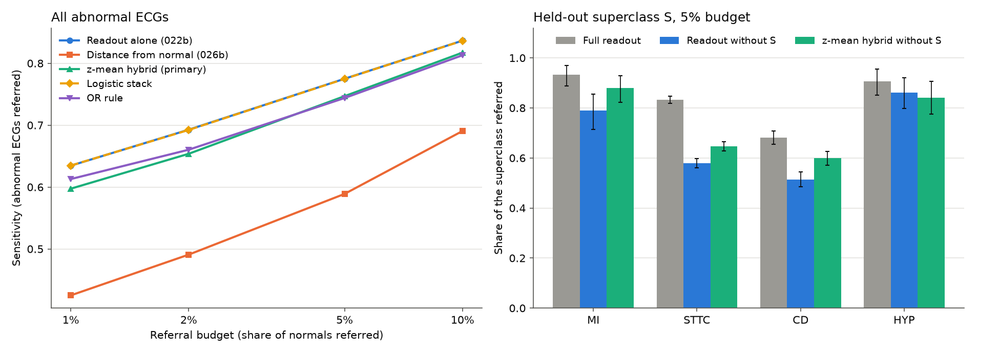

# Experiment 031 results: a hybrid of the supervised readout and the distance from normal

Completed 29 September 2026 under the [frozen protocol](experiment-031-hybrid-screening-score.md) (frozen at
commit `63afa31`, whose file hash the run recorded). Run once at commit `9279d31` on CPU in 167 s, one
process with at most four threads (the readout refits used one). Local outputs are in
`outputs/experiment031_hybrid_score_v1/` (`result.json` SHA-256 `5c323e6d…d0e1`, `draws.csv`, `run.log`).
No Challenge test-group ECG, no PTB-XL test ECG and no PTB-XL calibration ECG was read. This covers the
backlog item `hybrid_screening_score`.

Before the run, the scoring, bootstrap, summary and decision code was exercised on synthetic scores only. No
real score was computed before the run.

**SPH is development data.** Experiments 022, 022b, 024b, 026, 026b, 027, 027b, 029 and 030 have all read
it. This is a simulation of a new site, not a final test.

## Integrity

- 029's split and every input receipt matched (030's checks). The S-only counts, the 7,612 Challenge
  calibration records (1,707 normal) and the held-out training and calibration counts matched the protocol.
- The readout alone and the distance alone reproduced 030's `draws.csv` exactly (m = 200 and 1,000, every
  budget, xECG and JEPA): threshold and rate differences 0.0.
- Refitting the pooled readout on all 39,577 rows reproduced 022b's SPH and Challenge calibration
  probabilities exactly (difference 0.0) for both encoders, before any held-out readout was fitted.
- Every stack converged; per-ECG referral shares reproduced every draw mean to 1e-9.

## Primary: xECG, 5% budget, 200 local normals

| Rule | Sensitivity [95% CI] | Minus readout [95% CI] | Achieved rate | Rate minus readout |
| --- | --- | --- | ---: | --- |
| Readout alone (022b) | 0.775 [0.761, 0.788] | | 5.53% | |
| z-mean hybrid (primary) | 0.747 [0.733, 0.760] | **−0.028 [−0.035, −0.022]** | 5.61% | +0.1 pp [−0.2, +0.4] |
| Logistic stack | 0.775 [0.761, 0.787] | −0.000 [−0.001, +0.001] | 5.49% | −0.0 pp |
| OR rule | 0.744 [0.730, 0.757] | −0.031 [−0.036, −0.026] | 5.57% | +0.0 pp [−0.3, +0.4] |
| Distance alone (026b) | 0.589 [0.573, 0.605] | −0.186 [−0.199, −0.173] | 5.40% | −0.1 pp |

**Decision: the hybrid hurts; the readout alone stays.** The interval of the primary difference lies
entirely below 0. At the same referral rate, averaging in the distance from normal catches about 3 fewer
abnormal ECGs per 100. No secondary rule met the adoption criteria.

The stack learned to ignore the distance. Its coefficients on the standardized scores were 2.02 (readout)
and −0.10 (distance) for xECG, and 1.81 and +0.07 for JEPA, so it refers almost exactly the readout's ECGs.

### Every budget and number of local normals

Sensitivity, xECG. Hybrid minus readout in brackets, with 200 local normals.

| Budget | Readout | z-mean | Stack | OR rule | Distance |
| --- | ---: | --- | --- | --- | ---: |
| 1% | 0.635 | 0.597 (−0.037 [−0.043, −0.031]) | 0.635 (+0.000) | 0.613 (−0.022 [−0.025, −0.018]) | 0.425 |
| 2% | 0.693 | 0.654 (−0.039 [−0.046, −0.032]) | 0.692 (−0.000) | 0.660 (−0.032 [−0.037, −0.028]) | 0.491 |
| 5% | 0.775 | 0.747 (−0.028 [−0.035, −0.022]) | 0.775 (−0.000) | 0.744 (−0.031 [−0.036, −0.026]) | 0.589 |
| 10% | 0.837 | 0.817 (−0.019 [−0.026, −0.013]) | 0.836 (−0.000) | 0.813 (−0.024 [−0.029, −0.018]) | 0.691 |

- **1,000 local normals:** the same picture. At 5%, z-mean minus readout is −0.031 [−0.038, −0.023]
  (0.741 against 0.772).
- **Source normals (m = 0, 1,707 Challenge calibration normals):** z-mean refers only 2.67% of SPH normals
  at a 5% budget, against 5.28% for the readout, so its sensitivity is 0.667 against 0.773 (−0.106). This
  is mostly the distance's rate problem from 030 (SPH normals look closer to the reference than source
  normals do), carried into the hybrid.
- **JEPA** agrees: at 5% with 200 normals, z-mean minus readout is −0.032 [−0.038, −0.025], the OR rule
  −0.024 [−0.030, −0.020] and the stack −0.000.
- The achieved false-referral rates of all rules match within 0.3 pp at every budget with local normals
  (for example 5.49-5.61% at 5%), so the differences are in sensitivity, not in how many normals were
  referred.

### By superclass

xECG, 200 local normals, share of each superclass referred; z-mean minus readout with its interval.

| Budget | Superclass | Readout | z-mean | Distance | z-mean minus readout |
| --- | --- | ---: | ---: | ---: | --- |
| 1% | MI (122) | 0.820 | 0.837 | 0.684 | +0.017 [−0.006, +0.044] |
| | STTC (2,507) | 0.681 | 0.631 | 0.422 | −0.050 [−0.058, −0.042] |
| | CD (1,184) | 0.581 | 0.573 | 0.481 | −0.008 [−0.017, +0.000] |
| | HYP (117) | 0.831 | 0.804 | 0.726 | −0.028 [−0.058, −0.001] |
| 5% | MI | 0.932 | 0.909 | 0.835 | −0.023 [−0.049, −0.003] |
| | STTC | 0.833 | 0.793 | 0.602 | −0.040 [−0.048, −0.033] |
| | CD | 0.681 | 0.686 | 0.604 | +0.005 [−0.005, +0.015] |
| | HYP | 0.907 | 0.862 | 0.774 | −0.045 [−0.083, −0.007] |

Conduction findings, the readout's main misses in 030, are where the distance is closest to the readout
(0.604 against 0.681 at 5%). There the hybrid breaks even (+0.005), but it does not catch more; STTC,
the largest group, loses 4 in 100.

## Held-out conditions (026's design)

For each superclass S the pooled readout was refitted without every training ECG carrying S, and the
hybrids were rebuilt from it. xECG, 5% budget, 200 local normals. Share of the evaluation S ECGs referred:

| S (ECGs) | Full readout | Readout without S | z-mean without S | Distance alone | z-mean minus readout without S |
| --- | ---: | ---: | ---: | ---: | --- |
| MI (122) | 0.932 | 0.790 | 0.879 | 0.835 | **+0.090 [+0.048, +0.139]** |
| STTC (2,507) | 0.833 | 0.579 | 0.647 | 0.602 | **+0.068 [+0.057, +0.078]** |
| CD (1,184) | 0.681 | 0.514 | 0.599 | 0.604 | **+0.085 [+0.070, +0.100]** |
| HYP (117) | 0.907 | 0.861 | 0.840 | 0.774 | −0.021 [−0.049, +0.005] |

S-only ECGs (no other abnormal superclass):

| S-only (ECGs) | Full readout | Readout without S | z-mean without S | z-mean minus readout without S |
| --- | ---: | ---: | ---: | --- |
| MI (37) | 0.795 | 0.561 | 0.682 | +0.121 [+0.043, +0.213] |
| STTC (2,194) | 0.813 | 0.525 | 0.604 | +0.079 [+0.067, +0.091] |
| CD (995) | 0.628 | 0.440 | 0.536 | +0.096 [+0.079, +0.114] |
| HYP (27) | 0.636 | 0.471 | 0.438 | −0.032 [−0.120, +0.064] |

**Reading: the normal reference helps for an unseen MI, STTC and CD** (intervals above 0), **not for HYP**
(interval includes 0). The gain is 7-9 more ECGs of the unseen condition caught per 100, at the same
referral rate, and it holds at every budget (MI +0.045 to +0.093, STTC +0.065 to +0.077, CD +0.072 to
+0.106 from 1% to 10%). It recovers about half of what the missing labels cost for CD (0.085 of 0.167) and
nearly two thirds for MI (0.090 of 0.143), but only about a quarter for STTC (0.068 of 0.254). It does not
bring the unseen condition back to the full readout: z-mean without S minus the full readout is −0.053
(MI), −0.186 (STTC), −0.082 (CD) and −0.067 (HYP), every interval below 0.

- **OR rule without S:** also helps, less: +0.051 (MI), +0.044 (STTC), +0.083 (CD), −0.008 (HYP).
- **Stack without S:** no help (−0.005 to −0.016 for xECG). Fitted on Challenge calibration records without
  S, it again gave the distance a weight near 0. The calibration data contain only findings the readout
  was trained on, so a supervised stack cannot learn what the distance is for.
- **JEPA:** helps for STTC (+0.060 [+0.050, +0.070]) and CD (+0.060 [+0.046, +0.075]), not for MI (+0.004
  [−0.029, +0.039]) or HYP (−0.014). This matches 026, where the JEPA distance was weakest on MI.
- **Overall sensitivity** with one superclass held out still falls with the hybrid for MI (−0.020) and HYP
  (−0.024), and rises for STTC (+0.035), whose removal took 43% of the training rows. CD is flat (+0.003).

*xECG at SPH, 200 local normals. Left: sensitivity against budget per rule (the stack's dashed line lies on
the readout's). Right: share of each superclass referred at a 5% budget by the full readout, the readout
refitted without that superclass, and the z-mean hybrid built on it, with 95% patient-bootstrap intervals.*

## What it means for the student screen

- **Keep the readout alone.** When the readout has been trained on the findings being screened for, adding
  the distance from normal only dilutes it: at a 5% budget, per 1,000 students with 5% abnormal ECGs, the
  z-mean hybrid would catch about 37 of 50 against 39 for the readout, with the same 91 referrals.
- **The distance is insurance for findings missing from the labels.** When a superclass had no training
  label, the hybrid caught 7-9 more of those ECGs per 100 (MI, STTC, CD). That is the case a normal
  reference was meant for, and it is real, but it costs 2-3 in 100 of everything else. Which trade is worth
  it depends on whether the student screen targets findings the public labels cover. The findings that
  matter most in young people (cardiomyopathy patterns, pre-excitation, long QT, Brugada) are rare or
  absent as separate labels here, which argues for looking at them directly rather than assuming either
  score catches them.
- **Do not fit the combination on labeled source data.** A stack fitted on data the readout already knows
  sets the distance's weight to zero. If a hybrid is used, its weight has to be chosen for the unseen
  case, for example by holding out conditions as done here, not by maximizing fit on known ones.
- **Questions for the cardiologist.** Which conditions should the screen catch that are not in the PTB-XL
  and Challenge labels? If the answer is a real list, those are the candidates for a held-out test like this
  one, and possibly for a small weight on the distance.

## Surprises

- The logistic stack gave the distance essentially no weight (−0.10 on standardized scores for xECG), and
  the same with every superclass held out. Supervised combination on known findings cannot see the value of
  the unsupervised score.
- The hybrid did not help for conduction findings with the full readout (+0.005), even though they were
  030's main misses and the distance is closest to the readout there. Missed CD ECGs are apparently missed
  by both scores.
- HYP is the exception in the held-out analysis: without HYP labels the readout still caught 0.861 of HYP
  ECGs (it learns hypertrophy from co-occurring findings and from voltage), and the distance added nothing.

## Caveats

- SPH has been read by several earlier experiments; this is a simulation, not a final test.
- SPH is an older Chinese hospital cohort at 34% prevalence, heavily band-pass filtered; its normals are
  hospital normals, not healthy students. The label is an ECG annotation proxy, not confirmed disease or a
  referral decision. MI and HYP have 122 and 117 evaluation ECGs, and 37 and 27 S-only ECGs.
- Holding out a whole superclass is a crude stand-in for a rare unseen finding: a truly rare condition may
  be subtler, or much further from normal, than a whole superclass.
- The Challenge calibration families were in the readout's training groups (record split), which flatters
  the readout in the stack's fitting data.
- The z-mean weight (equal) was fixed in advance and not tuned; a smaller weight on the distance might
  trade differently, but choosing it on SPH would make SPH a tuning set.
- One split, one fit per readout and reference. No age or other subgroup analysis was done.
