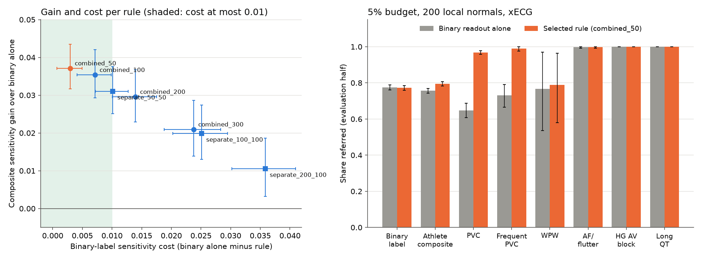

# Experiment 033 results: one referral budget shared by the binary readout and the PVC and WPW heads

Completed 29 September 2026 under the [frozen protocol](experiment-033-finding-heads-screen.md) (frozen at
commit `7588407`; the run recorded its file hash, `032913d7…3041`, which matches). Run once at commit
`c9ba82a` on CPU in 12 s, one process with at most three threads. Local outputs are in
`outputs/experiment033_finding_heads_screen_v1/` (`result.json` SHA-256 `e0dafb15…7752`, `draws.csv`,
`run.log`). No PTB-XL calibration or test ECG and no Challenge test-group ECG was read. This covers the
backlog item `screen_with_finding_heads`.

Before the freeze, one `--counts` pass stopped before any score entered a rule; it produced the counts in the
protocol. No other pass was made.

SPH is development data. Experiments 022-032 have all read it, so this is a simulation of a new site, not a
final test.

## Integrity

- Every count matched the protocol. The 4,569 SPH ECGs without a binary label were added without changing any
  030 assignment (204 joined their patient's half, 4,278 new patients were split with seed 33033), and the
  local and evaluation normals are exactly 030's.
- 032's binary readout equalled 022b's SPH probabilities exactly (largest difference 0.0).
- 032's SPH sensitivities at 5% reproduced exactly: PVC head 0.980, binary on PVC ECGs 0.616, WPW head 1.000,
  binary on WPW ECGs 0.704.
- The binary readout alone reproduced 030's pooled xECG draws exactly (threshold, rate and sensitivity of all
  1,200 draws at m = 200 and 1,000 and budgets 2%, 5% and 10%; largest difference 0.0).
- 1,707 Challenge calibration normals standardized the heads; no probability needed clipping. No bootstrap
  resample lacked an ECG of any outcome.

Intervals are 95% paired patient-bootstrap intervals over the evaluation half (12,320 patients, 2,000
resamples, seed 37037). Every value is the mean over the 200 local-normal draws.

## Primary: 5% budget, 200 local normals

The rule selected on the local pool was `combined_50`: refer when the binary readout passes its threshold or
when the combined finding score, max(z_PVC, z_WPW), is above every one of the 200 local normals. With k = 10,
the finding score gets rank 0 and the binary readout 9 of the 10 normals.

| Outcome (evaluation half) | Binary readout alone | `combined_50` | Difference [95% CI] |
| --- | --- | --- | --- |
| Athlete-criteria composite (4,052) | 0.757 [0.744, 0.770] | 0.794 [0.782, 0.806] | +0.037 [+0.032, +0.043] |
| Binary label (3,584) | 0.775 [0.761, 0.788] | 0.772 [0.758, 0.785] | −0.003 [−0.005, −0.001] |
| Achieved false-referral rate (6,895 normals) | 5.53% | 5.41% | −0.12 pp [−0.23, −0.01] |
| PVC (531) | 0.647 [0.608, 0.686] | 0.968 [0.957, 0.978] | +0.321 [+0.285, +0.359] |
| Frequent PVC (183) | 0.732 | 0.991 | +0.259 [+0.201, +0.321] |
| WPW (15) | 0.766 [0.537, 0.970] | 0.790 [0.579, 0.963] | +0.024 [−0.015, +0.073] |
| Composite, binary label not positive (468) | 0.619 | 0.963 | +0.344 [+0.304, +0.385] |
| Other unlabeled ECGs (1,812), share referred | 0.255 | 0.254 | −0.001 [−0.004, +0.003] |

AF/flutter (370), high-grade AV block (12) and long QT (10) are referred at 0.997-1.000 by both.

Decision: adopt. All three pre-registered conditions hold. The composite gain is +0.037, with its interval
above 0. The binary-label cost is 0.003, below 0.010, and the achieved rate is 0.12 points lower, not higher.

In counts on the evaluation half, the rule refers about 150 more of the 4,052 athlete-criteria abnormal ECGs
and about 170 more of the 531 PVC ECGs. It refers about 11 fewer of the 3,584 binary-positive ECGs and about 8
fewer of the 6,895 normals. Across the 200 draws its PVC sensitivity ranges 0.908-0.987 (5th-95th percentile)
and the achieved rate 3.1-8.0%, against 3.3-8.1% for the binary readout alone.

## Every pre-registered rule at 5% and m = 200

"Local" columns are the selection step on the local pool; the others are the evaluation half.

| Rule | Local composite | Local binary cost | Composite gain [95% CI] | Binary cost [95% CI] | Rate difference | PVC | WPW |
| --- | ---: | ---: | --- | --- | ---: | ---: | ---: |
| `combined_50` (selected) | 0.785 | 0.005 | +0.037 [+0.032, +0.043] | 0.003 [0.001, 0.005] | −0.12 pp | 0.968 | 0.790 |
| `combined_100` (90/10) | 0.782 | 0.010 | +0.035 [+0.029, +0.042] | 0.007 [0.004, 0.010] | −0.09 pp | 0.984 | 0.838 |
| `combined_200` (80/20) | 0.776 | 0.017 | +0.030 [+0.023, +0.037] | 0.014 [0.010, 0.018] | −0.10 pp | 0.986 | 0.880 |
| `combined_300` | 0.767 | 0.027 | +0.021 [+0.014, +0.029] | 0.024 [0.019, 0.028] | −0.22 pp | 0.987 | 0.916 |
| `separate_50_50` | 0.778 | 0.012 | +0.031 [+0.025, +0.038] | 0.010 [0.007, 0.013] | −0.24 pp | 0.971 | 0.806 |
| `separate_100_100` | 0.767 | 0.027 | +0.020 [+0.013, +0.027] | 0.025 [0.020, 0.030] | −0.29 pp | 0.988 | 0.869 |
| `separate_200_100` | 0.759 | 0.037 | +0.011 [+0.003, +0.019] | 0.036 [0.030, 0.041] | −0.34 pp | 0.990 | 0.866 |

- Every rule catches more composite ECGs than the binary readout alone; every gain interval is above 0.
- The gain falls and the cost rises with the finding share. PVC sensitivity is already 0.968 at rank 0 and
  reaches only 0.990 at the largest shares, so the extra normals given to the heads mostly pay for WPW ECGs
  and cost binary sensitivity.
- Only `combined_50` and `combined_100` were eligible on the local pool (cost at most 0.010), and
  `combined_50` also had the highest local composite sensitivity of all seven.
- `combined_100` also meets all three conditions on the evaluation half. By the protocol it is a hypothesis
  for a new test, not adopted. `separate_50_50` misses the cost limit narrowly (0.0101).
- The rules with separate PVC and WPW thresholds do no better than one combined score: the second threshold
  costs one more normal from the binary readout.

## Other budgets and 1,000 local normals (secondary)

`combined_50` against the binary readout alone:

| Budget | m | Composite gain [95% CI] | Binary cost [95% CI] | Rate difference | PVC alone → with heads |
| --- | ---: | --- | --- | ---: | --- |
| 2% | 200 | +0.038 [+0.032, +0.046] | 0.011 [0.007, 0.014] | −0.06 pp | 0.559 → 0.962 |
| 5% | 200 | +0.037 [+0.032, +0.043] | 0.003 [0.001, 0.005] | −0.12 pp | 0.647 → 0.968 |
| 10% | 200 | +0.029 [+0.024, +0.035] | 0.004 [0.002, 0.006] | −0.22 pp | 0.732 → 0.987 |
| 2% | 1,000 | +0.050 [+0.043, +0.058] | 0.000 [−0.003, 0.003] | −0.03 pp | 0.540 → 0.966 |
| 5% | 1,000 | +0.042 [+0.036, +0.049] | −0.000 [−0.003, 0.002] | −0.04 pp | 0.642 → 0.979 |
| 10% | 1,000 | +0.031 [+0.026, +0.037] | 0.002 [−0.000, 0.003] | −0.08 pp | 0.733 → 0.986 |

At 2% with 200 normals the cost is 0.011, just above the limit: with k = 4, giving up one normal is a
quarter of the binary budget. With 1,000 local normals the cost is zero within its interval at every budget,
because one normal is then a small part of k and the top normals of the two scores overlap. The composite
gain is largest at small budgets, where the binary readout misses the most PVC ECGs.

## Surprises

- The smallest share won. Referring only ECGs whose PVC or WPW score is above every one of 200 local normals
  already catches 97% of PVC ECGs. 032's heads separate PVC ECGs from normal ECGs almost completely, so a
  threshold at the most extreme normal is enough, and a larger share buys little.
- WPW gained little from the selected rule (+0.024, interval including 0, 15 ECGs). A post-hoc look, not
  pre-registered: the most extreme of 200 normals has a combined z of about 3.2 (median over draws; the WPW
  head sets it in 114 draws, the PVC head in 86), and 4 of the 15 WPW ECGs have a WPW z below 2.9. The WPW
  head's normal tail reaches the weaker WPW ECGs, so a threshold at the top normal misses them. WPW
  sensitivity rises to 0.84-0.92 only with the larger combined shares, at a cost to the binary label.
- The binary readout alone catches fewer composite ECGs (0.757) than binary positives (0.775): the composite
  adds 468 PVC and AF ECGs without a binary label, and it misses 38% of them.
- The OR rules referred slightly fewer normals than the binary readout alone (by 0.1-0.3 points). The
  pre-registered one-normal allowance per extra threshold is a little conservative when the scores are
  correlated, as the synthetic simulation predicted.
- The heads did not pull in more of the "other" unlabeled ECGs (sinus bradycardia or tachycardia, atrial
  premature beats): 0.254 against 0.255.

## What this means for student screening

- A screen for the athlete criteria should use the PVC and pre-excitation heads, not only the binary readout.
  At a 5% budget the combined rule refers about 32 more of every 100 PVC ECGs. It costs about 3 in 1,000
  abnormal ECGs on the binary label and adds no false referrals.
- The rule is simple to state: refer when the binary readout is in its top share of the pilot's normal ECGs,
  or when the PVC or WPW score is higher than on every normal pilot ECG. It also gives the cardiologist a named
  reason for the referral.
- The finding threshold rests on the single most extreme normal pilot ECG. A pilot ECG called normal that
  actually has a PVC would raise it and could hide real PVCs. The pilot normals must be read with the athlete
  criteria in mind, and a larger pilot (1,000 normals) makes the rule steadier and removes the binary cost.
- The PVC label marks any PVC, not two or more per 10 s. For the frequent-PVC subset, closer to the
  criterion, the rule refers 99%. Whether one isolated PVC in a student should lead to a referral is for the
  cardiologist.
- Pre-excitation, the finding with the most at stake in young people, rests on 15 SPH ECGs here. The selected
  rule refers 79% of them and the binary readout alone 77%, both with wide intervals. If WPW matters most, a
  separate WPW threshold with its own share is the next thing to test, ideally on more WPW ECGs.

## Caveats

- SPH is development data (022-032), an older Chinese hospital cohort. Its PVC and WPW ECGs come from
  patients, not students. The local pool and evaluation half come from the same hospital, the most favourable
  case.
- The share was selected on the local pool's abnormal ECGs, which a real site would not have. It is a
  development choice made once, before the evaluation half was read.
- WPW (15), high-grade AV block (12) and long QT (10) have few evaluation ECGs; their numbers are descriptive.
- The labels are annotation statements. A PVC code marks at least one PVC, and the long-QT codes use
  general-medicine limits.
- One fit per head; only the local normals and the evaluation patients vary. The 4,569 added ECGs were split
  by a new seed; 030's own split and draws are unchanged.

## Figure

Left: composite gain against binary-label cost for the seven rules at 5% and m = 200, with 95% intervals; the
shaded band is the pre-registered cost limit. Right: the share of each group referred by the binary readout
alone and by the selected rule.

