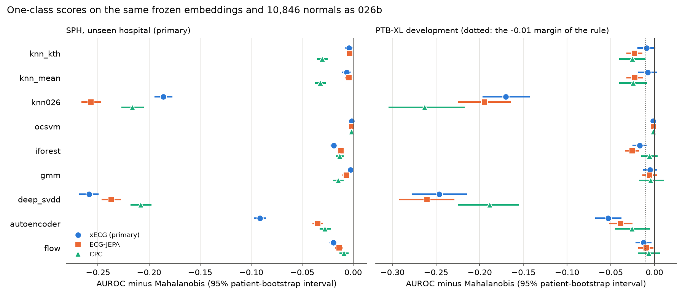

# Experiment 034 results: one-class baselines on the frozen embeddings

Completed 29 September 2026 under the [frozen protocol](experiment-034-one-class-baselines.md) (frozen at
commit `355f756`; the run recorded the same file hash). Run once at commit `b3064b9` on CPU in 2,215 s,
three encoder processes with one thread each. Local outputs are in
`outputs/experiment034_one_class_baselines_v1/` (`result.json` SHA-256 `04ff9404…86d4`, per-row scores for
SPH, development and the Challenge calibration groups, and `run.log`). No PTB-XL calibration or test ECG and
no Challenge test-group ECG was read. This covers the backlog item `one_class_embedding_baselines`.

**SPH is development data.** Experiments 022 to 030 have read it. It is unseen by every encoder, but this
is not a final test.

## Integrity

- The Mahalanobis reference reproduced 026b's saved `pooled` scores exactly for all three encoders: the
  largest difference over every SPH, development and Challenge calibration ECG was 0.0. The reference AUROCs
  below are therefore 026b's.
- The fit set was 026b's pooled set, 10,846 normals in 026b's order; every count matched the protocol.
- The tuning slice held out 1,085 fit normals (1,052 of 10,511 units). No evaluation row entered any choice.
- No method passed the 30-minute wall-time cap, so none was dropped. The slowest was the Gaussian mixture
  (98-121 s, most of it spent on tuning); the flow took 41-48 s and the autoencoder 58 s.
- No bootstrap draw was skipped in any set.

Intervals are 95% paired bootstrap intervals from `intervals.paired_auroc_difference` (2,000 draws, seed
38038): by patient for SPH and development, by record for the Challenge families.

## 1. xECG, SPH and PTB-XL development (primary encoder)

AUROC, and each method minus Mahalanobis. SPH: 21,008 ECGs, 7,190 positive. Development: 1,306 ECGs, 843
abnormal.

| Method | SPH AUROC | SPH minus Mahalanobis | Development AUROC | Development minus Mahalanobis |
| --- | ---: | --- | ---: | --- |
| `mahalanobis` (reference) | 0.878 | | 0.920 | |
| `ocsvm` | 0.876 | -0.001 [-0.002, -0.001] | 0.918 | -0.002 [-0.002, -0.001] |
| `gmm` (K = 8) | 0.875 | -0.002 [-0.005, +0.000] | 0.915 | -0.005 [-0.012, +0.002] |
| `knn_kth` (k = 10) | 0.874 | -0.004 [-0.007, -0.001] | 0.911 | -0.009 [-0.019, +0.000] |
| `knn_mean` (k = 10) | 0.871 | -0.006 [-0.010, -0.003] | 0.912 | -0.008 [-0.018, +0.002] |
| `iforest` | 0.859 | -0.019 [-0.021, -0.017] | 0.903 | -0.017 [-0.024, -0.010] |
| `flow` | 0.858 | -0.019 [-0.022, -0.017] | 0.907 | -0.013 [-0.021, -0.004] |
| `autoencoder` | 0.786 | -0.091 [-0.097, -0.086] | 0.867 | -0.053 [-0.067, -0.039] |
| `knn026` (026's kNN) | 0.692 | -0.186 [-0.194, -0.178] | 0.750 | -0.170 [-0.196, -0.144] |
| `deep_svdd` | 0.619 | -0.259 [-0.268, -0.250] | 0.674 | -0.246 [-0.277, -0.215] |

Average precision at SPH follows the same order: Mahalanobis 0.834, one-class SVM 0.833, GMM 0.829, kNN
0.826-0.828, flow 0.807, isolation forest 0.811, autoencoder 0.726, `knn026` 0.605, Deep SVDD 0.497.

No SPH interval lies above 0. Every one is below 0 except the Gaussian mixture's, which includes 0.



## 2. ECG-JEPA and CPC (secondary)

| Method | JEPA SPH | JEPA SPH minus Mahalanobis | JEPA dev | CPC SPH | CPC SPH minus Mahalanobis | CPC dev |
| --- | ---: | --- | ---: | ---: | --- | ---: |
| `mahalanobis` | 0.865 | | 0.906 | 0.806 | | 0.818 |
| `ocsvm` | 0.863 | -0.002 [-0.002, -0.001] | 0.905 | 0.804 | -0.002 [-0.002, -0.001] | 0.817 |
| `knn_kth` | 0.861 | -0.004 [-0.006, -0.001] | 0.883 | 0.776 | -0.030 [-0.035, -0.026] | 0.793 |
| `knn_mean` | 0.861 | -0.004 [-0.007, -0.001] | 0.883 | 0.774 | -0.032 [-0.037, -0.027] | 0.793 |
| `gmm` | 0.858 | -0.007 [-0.010, -0.004] | 0.900 | 0.792 | -0.014 [-0.019, -0.010] | 0.814 |
| `iforest` | 0.853 | -0.012 [-0.014, -0.010] | 0.880 | 0.793 | -0.013 [-0.016, -0.010] | 0.812 |
| `flow` | 0.851 | -0.014 [-0.017, -0.011] | 0.896 | 0.797 | -0.009 [-0.013, -0.005] | 0.811 |
| `autoencoder` | 0.830 | -0.035 [-0.039, -0.030] | 0.867 | 0.779 | -0.027 [-0.032, -0.023] | 0.792 |
| `deep_svdd` | 0.628 | -0.237 [-0.246, -0.228] | 0.645 | 0.598 | -0.208 [-0.217, -0.198] | 0.629 |
| `knn026` | 0.608 | -0.257 [-0.266, -0.248] | 0.711 | 0.590 | -0.216 [-0.226, -0.206] | 0.555 |

Every SPH interval lies below 0 for both encoders. On development, every JEPA and CPC method is below
Mahalanobis; the smallest gap is the one-class SVM's (0.001).

## 3. Challenge calibration groups, xECG (secondary)

The pooled fit set includes each family's training normals, so this is an in-distribution readout.

| Method | Chapman/Ningbo (4,432) | minus Mahalanobis | Georgia (1,718) | minus Mahalanobis | CPSC (1,462) | minus Mahalanobis |
| --- | ---: | --- | ---: | --- | ---: | --- |
| `mahalanobis` | 0.944 | | 0.901 | | 0.872 | |
| `knn_kth` | 0.952 | +0.008 [+0.004, +0.011] | 0.900 | -0.001 [-0.011, +0.009] | 0.866 | -0.006 [-0.019, +0.008] |
| `knn_mean` | 0.953 | +0.008 [+0.004, +0.012] | 0.900 | -0.000 [-0.010, +0.010] | 0.867 | -0.005 [-0.019, +0.011] |
| `ocsvm` | 0.944 | -0.001 [-0.001, -0.001] | 0.900 | -0.001 [-0.001, -0.000] | 0.871 | -0.001 [-0.002, -0.000] |
| `gmm` | 0.941 | -0.004 [-0.007, -0.001] | 0.905 | +0.004 [-0.004, +0.012] | 0.869 | -0.003 [-0.014, +0.009] |
| `iforest` | 0.939 | -0.005 [-0.009, -0.002] | 0.887 | -0.013 [-0.021, -0.006] | 0.850 | -0.022 [-0.034, -0.010] |
| `flow` | 0.937 | -0.007 [-0.010, -0.004] | 0.887 | -0.014 [-0.024, -0.005] | 0.863 | -0.009 [-0.022, +0.004] |
| `autoencoder` | 0.902 | -0.043 [-0.049, -0.037] | 0.843 | -0.058 [-0.074, -0.043] | 0.825 | -0.047 [-0.068, -0.027] |
| `knn026` | 0.809 | -0.136 [-0.148, -0.124] | 0.761 | -0.140 [-0.164, -0.114] | 0.737 | -0.135 [-0.173, -0.097] |
| `deep_svdd` | 0.690 | -0.254 [-0.270, -0.238] | 0.660 | -0.241 [-0.272, -0.209] | 0.639 | -0.233 [-0.282, -0.187] |

The kNN scores are above Mahalanobis at Chapman/Ningbo with intervals above 0 for xECG (+0.008), JEPA
(+0.005) and, for `knn_kth` only, CPC (+0.005). They are not better at Georgia or CPSC. The only other
interval above 0 in any family is CPC's one-class SVM at CPSC (+0.001 [+0.000, +0.002]).

## 4. Sensitivity at a 5% referral budget, xECG, SPH (secondary)

030's rule, threshold set on the 1,707 Challenge calibration normals, applied to all SPH ECGs. The last
column sets the threshold on the SPH normals themselves (sensitivity at 95% specificity), without an
interval.

| Method | SPH normals referred | Sensitivity [95% CI] | Sensitivity, SPH-normal threshold |
| --- | --- | --- | ---: |
| `mahalanobis` | 1.4% [1.2, 1.6] | 0.449 [0.438, 0.461] | 0.592 |
| `ocsvm` | 1.4% [1.2, 1.6] | 0.447 [0.436, 0.459] | 0.592 |
| `gmm` | 1.6% [1.4, 1.8] | 0.448 [0.437, 0.460] | 0.590 |
| `knn_kth` | 1.6% [1.4, 1.8] | 0.449 [0.437, 0.462] | 0.580 |
| `knn_mean` | 1.8% [1.6, 2.0] | 0.462 [0.451, 0.474] | 0.582 |
| `iforest` | 1.7% [1.5, 1.9] | 0.432 [0.421, 0.444] | 0.554 |
| `flow` | 1.1% [0.9, 1.2] | 0.381 [0.370, 0.393] | 0.548 |
| `autoencoder` | 1.6% [1.4, 1.8] | 0.321 [0.311, 0.333] | 0.425 |
| `knn026` | 5.1% [4.8, 5.5] | 0.280 [0.269, 0.291] | 0.278 |
| `deep_svdd` | 3.6% [3.2, 3.9] | 0.144 [0.136, 0.153] | 0.174 |

A threshold set on the Challenge normals refers only 1.1-1.8% of SPH normals for most methods instead of
5%: SPH normals sit closer to the reference than the Challenge calibration normals do. The operating point
does not transfer between sites, whichever score is used, as 030 found for the supervised readout. At the
same specificity (last column), Mahalanobis, the one-class SVM and the mixture tie at 0.59.

## Tuning choices (normal-only, fixed before scoring)

- Gaussian mixture: held-out log-likelihood chose K = 8 for xECG and JEPA, and K = 16 (the largest
  candidate) for CPC.
- Deep SVDD: 92 epochs (xECG), 134 (JEPA and CPC). Autoencoder: 295-299 epochs, at the 300-epoch limit, so
  its held-out error was still falling. Flow: 8-13 epochs, after which held-out likelihood worsened.

## Prespecified reading

- **Primary: Mahalanobis stays the reference.** No method has an xECG SPH interval above 0. The closest are
  the one-class SVM (-0.001 [-0.002, -0.001]) and the mixture (-0.002 [-0.005, +0.000]), then the kNN
  scores (-0.004 and -0.006). No method passes the first condition, so the development condition is not
  reached.
- **Secondary encoders:** the same for ECG-JEPA and CPC. Every SPH contrast is below 0.
- **Families:** the kNN scores beat Mahalanobis at Chapman/Ningbo (+0.008 for xECG), whose training
  normals are in the fit set; nothing else beats it by more than 0.001 with an interval above 0.
- **Referral budget:** no method gives a clearly higher sensitivity at 5% than Mahalanobis. `knn_mean` is
  0.013 higher, but it also refers more SPH normals (1.8% against 1.4%).
- Dropped methods: none. All ran well within the cap.

## What this means for the paper claim

- **The Gaussian is not just the simplest density, it is as good as any we tried.** On the same features and
  normals, none of nine alternatives beat it at the unseen hospital, on any encoder. The flexible ones that
  are well behaved (one-class SVM with an RBF kernel, an eight-component mixture) end up within 0.002 AUROC:
  they learn nearly the same ranking. A plausible reason for the one-class SVM's near-identity is that its
  kernel is wide on whitened coordinates, so its boundary is close to an ellipsoid; this was not tested.
- **So the result rests on the embedding and on the reference set, not on a clever density.** That makes the
  claim cleaner: "a training-free Gaussian distance on frozen foundation embeddings" is the right framing,
  and a reviewer's "why not kNN or Deep SVDD?" now has a direct answer in one table.
- **The kNN result needs one correction to our earlier text.** 026 called kNN weak (0.56-0.75), but that was
  a mean cosine distance after per-dimension standardization. The kNN of Sun et al., on unit-length raw
  embeddings, is only 0.004 behind Mahalanobis at SPH for xECG and JEPA (0.874, 0.861). Standardizing before
  the cosine is what broke 026's version (0.692 on the same fit set). The paper should report the Sun et al.
  kNN as the strong nonparametric baseline and drop the claim that kNN fails.
- **Learned one-class models on the embedding are worse, not better.** The flow and isolation forest lose
  about 0.01-0.02; the autoencoder loses 0.03-0.09, and Deep SVDD without pretraining loses more than 0.2. Their
  training recipes were fixed rather than tuned on abnormal ECGs. A one-class screen has no abnormal ECGs to
  tune on, so fixed recipes are the fair setting, but the numbers should not be read as the best these
  models can do.

## Surprises

- Deep SVDD fell towards chance (0.60-0.63 at SPH, 0.63-0.67 on development). The likely reason is the
  known weakness of the one-class objective without the autoencoder pretraining of Ruff et al.: the network
  can shrink every input towards the centre, abnormal ones included. This run does not test that.
- The xECG autoencoder is much worse at SPH (0.786) than the JEPA one (0.830), although the xECG Mahalanobis
  is the better of the two. This run does not test why.
- The kNN scores beat Mahalanobis at Chapman/Ningbo for all three encoders. A local, nonparametric score does
  better where the fit set has many close neighbours from the same hospital, and worse at a hospital it has
  not seen.
- The source-quantile threshold refers only 1.4% of SPH normals at a 5% budget, much less than planned.

## Caveats

- One fit per method and encoder, one seed. The bootstrap holds the fits fixed.
- Seven of the ten methods see only the 64 principal components of the reference's PCA (89-95% of the
  standardized variance). Only the kNN scores use the full embedding. A method on the full embedding could
  behave differently; that belongs to the `manifold_score_ablation` item.
- The tuning slice was held out from each tuned method, not from the shared scaler and PCA. The autoencoder
  hit the 300-epoch limit.
- No multiplicity correction; since no method beat the reference, this does not affect the decision.
- ECG-JEPA and xECG were pretrained on Chapman and Ningbo waveforms, so the Chapman/Ningbo readout is not an
  unseen-hospital test for them. The Challenge calibration normals share the record-level split caveat of
  026b.
- The distance-from-normal score is an annotation proxy: a normal ECG is not proof of health, and none of
  these normals are young adults.

## Reproduce

```bash
PYTHONPATH=. OMP_NUM_THREADS=1 uv run --no-sync python -u -m scripts.experiments.run_one_class_baselines034
PYTHONPATH=. uv run --no-sync python -m scripts.reports.plot_one_class_baselines034
```

The runner refuses to overwrite an existing `result.json`. It needs 026b's outputs and the 025, 026 and 022
caches and `outputs/features_challenge_v1/`, each checked against its receipt.
