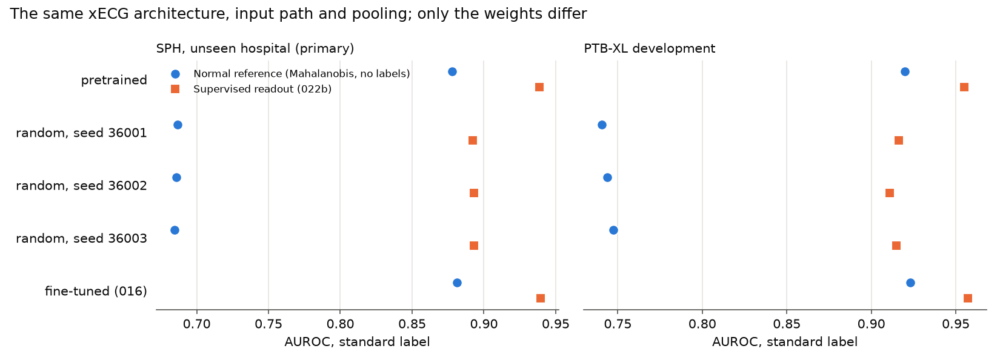

# Experiment 036 results: the normal reference on a random-weight xECG

Completed 30 September 2026 under the [frozen protocol](experiment-036-random-encoder.md) (frozen at commit
`f481ba9`; every stage recorded the same protocol hash, `ce387901…b592`). GPU extraction on the V100 under the
shared lock, then one CPU analysis of 762 s (two scoring and three bootstrap processes, one thread each).
Local outputs are in `outputs/experiment036_random_encoder_v1/` (`result.json` SHA-256 `c6df3c42…6de6`,
`profile.json`, `extraction.json`, `features_<set>.npz`, `scores.npz` and the logs). No PTB-XL calibration or
test ECG and no Challenge calibration or test ECG was read. This covers the backlog item
`random_encoder_control`.

**SPH is development data.** Experiments 022 to 034 have read it. It is unseen by every encoder here, but this
is not a final test.

## Answer

Yes: the normal reference needs self-supervised pretraining. With random weights in the same xECG
architecture, forward pass and pooling, its SPH AUROC falls from 0.878 to 0.686. The pretrained-minus-random
difference is **+0.192 [+0.185, +0.200]**, far above the 0.02 margin, and every seed agrees. The supervised
readout loses only 0.046 on the same random features. The label-free score depends on pretraining about four
times as much as a readout trained with labels does.

## 1. SPH (primary): 21,008 ECGs, 20,364 patients, 7,190 positive

AUROC with the standard label. The fit set and training rows are identical for every arm: 026b's 10,846
pooled normals for the normal reference, and 022b's 39,577 pooled rows for the readout.

| Arm | Normal reference (no labels) | Supervised readout |
| --- | ---: | ---: |
| `pretrained` | 0.878 | 0.939 |
| `random_36001` | 0.687 | 0.892 |
| `random_36002` | 0.686 | 0.893 |
| `random_36003` | 0.685 | 0.893 |
| `finetuned016` | 0.881 | 0.939 |

Differences in AUROC, 95% paired whole-patient intervals (2,000 draws, seed 40040, no draw skipped):

| Contrast | Normal reference | Supervised readout |
| --- | --- | --- |
| pretrained − random, mean of 3 seeds (**primary**) | **+0.192 [+0.185, +0.200]** | +0.046 [+0.043, +0.049] |
| pretrained − `random_36001` | +0.191 [+0.184, +0.199] | +0.047 [+0.043, +0.050] |
| pretrained − `random_36002` | +0.192 [+0.185, +0.200] | +0.046 [+0.042, +0.049] |
| pretrained − `random_36003` | +0.193 [+0.186, +0.201] | +0.046 [+0.042, +0.049] |
| `finetuned016` − pretrained | +0.004 [+0.002, +0.005] | +0.001 [+0.000, +0.001] |

- Share of the gap that is the embedding: the normal-reference gap minus the readout gap is **+0.146
  [+0.139, +0.154]**. On random features, the readout loses a quarter as much as the normal reference (0.046
  against 0.192): labels make up for most of the missing pretraining, and the label-free score has none.
- Average precision, SPH prevalence 0.342: normal reference 0.834 (pretrained), 0.495-0.496 (random), 0.843
  (fine-tuned); readout 0.917, 0.851-0.854 and 0.918.



## 2. PTB-XL development (secondary): 1,306 ECGs, 1,173 patients, 843 abnormal

| Arm | Normal reference | Supervised readout |
| --- | ---: | ---: |
| `pretrained` | 0.920 | 0.955 |
| random (3 seeds) | 0.741, 0.744, 0.747 | 0.916, 0.911, 0.915 |
| `finetuned016` | 0.923 | 0.957 |

- Pretrained − random mean: normal reference +0.176 [+0.150, +0.203]; readout +0.041 [+0.032, +0.051]; gap
  difference +0.135 [+0.109, +0.162].
- `finetuned016` − pretrained: +0.003 [+0.000, +0.006] and +0.002 [+0.001, +0.003]. These are optimistic,
  because 016 chose its epoch on this development set.

## 3. Per condition at SPH (secondary)

Each superclass against the 13,818 SPH primary negatives. The normal-reference AUROC comes first, then the
pretrained − random-mean contrast for both scores.

| Condition (positives) | Pretrained | Random (3 seeds) | Normal reference: pretrained − random | Readout: pretrained − random |
| --- | ---: | --- | --- | --- |
| MI (255) | 0.956 | 0.705-0.717 | +0.245 [+0.218, +0.272] | +0.049 [+0.036, +0.063] |
| STTC (5,037) | 0.892 | 0.717-0.723 | +0.173 [+0.165, +0.181] | +0.036 [+0.033, +0.039] |
| CD (2,365) | 0.861 | 0.623-0.632 | +0.234 [+0.222, +0.247] | +0.062 [+0.056, +0.068] |
| HYP (227) | 0.945 | 0.704-0.721 | +0.231 [+0.198, +0.266] | +0.044 [+0.029, +0.060] |

Every condition shows the same pattern: a large gap without labels and a small one with them. The random
reference is weakest on conduction disease (0.62-0.63) and least weak on ST-T changes (0.72). Fine-tuned minus
pretrained on the normal reference: MI −0.002 [−0.005, +0.001], STTC +0.006 [+0.005, +0.007], CD −0.002
[−0.004, +0.000], HYP +0.005 [+0.001, +0.009].

## Prespecified reading

- **Primary decision: pretraining is needed.** The mean-over-seeds interval, [+0.185, +0.200], lies above
  +0.02, and all three per-seed intervals lie above 0.
- Readout, gap share, development and the per-condition contrasts: every pretrained − random interval lies
  above 0, for both scores.
- The fine-tuned encoder: its SPH intervals lie above 0 but are small, +0.004 for the reference and +0.001 for
  the readout, both below the 0.005 "negligible in practice" level used since 022b.

## Integrity

- **Profile:** 512 records (the first 128 of each set) through all five arms. Projected total 4,609 s (77 min)
  against the 90-minute gate, so it passed. The pretrained arm reproduced the frozen features exactly on those
  512 records.
- **Full pass:** 3,930 s for 62,157 records with four arms (PTB-XL training 928 s, development 103 s, SPH
  1,580 s, Challenge 1,319 s). Each arm took about 10.5 ms per record. Reading took 19-40 ms per record with
  two threads.
- **Seeded construction:** each random model was built twice from its seed, with identical state-dict hashes
  (recorded in `extraction.json`). The fine-tuned model matched its 016 receipt. Its head reproduced 016's
  saved development logits to 5.3e-7.
- **Reproduction:** the normal reference on the frozen pretrained features reproduced 026b's `xecg_pooled`
  SPH and development scores with a largest difference of 0.0. The readout reproduced 022b's `xecg` `pooled`
  probabilities with a difference of 0.0. The pretrained numbers are therefore 026b's and 022b's.
- All five readouts converged, in 319-428 iterations. The per-seed contrasts from the shared draw matrix
  equal `intervals.paired_auroc_difference` exactly.

### Check-pass fixes, all made before any score was computed

The first check pass stopped the run. On the PTB-XL training sample the pretrained arm differed from the
frozen features by up to 9.5e-6, and the fine-tuned arm from its own saved features by up to 1.4e-5. A GPU
diagnosis showed that only the last 12 rows differed. My runner had merged the two check samples the protocol
names (the first 128 rows, and 512 evenly spaced rows) into one pass of 636 rows. Its last microbatch held 12
records instead of 16, and a partly filled microbatch changes float32 xECG features by about 1e-6 to 1e-5 on
this GPU. Full microbatches give identical results, whatever their composition.

- Fix 1 (`47343d0`): run the two samples in separate passes, as the protocol says. Each then fills whole
  microbatches.
- Fix 2 (`ab6979c`): the second attempt found the same effect in the frozen features themselves. Four
  development rows differed by up to 3.6e-6, three of them in the last partial microbatch of the 016 cache and
  one in that of 022's added rows. Differences are now allowed only on rows that the extraction being compared
  against computed in its own last, partly filled microbatch: the frozen extraction's for the pretrained arm,
  and this run's full pass for the others.

The final check passed. The first 128 rows were identical for all five arms in every set. On the evenly
spaced rows, the only differences (at most 3.6e-6) were on such rows, and none was unexplained. This does not
touch any score. The pretrained analysis uses the frozen features, which reproduce 026b and 022b exactly, and
each other arm's features come from its single full pass. The runner's identity comparison now leaves out the
runner's own hash, so the fix did not discard the content-hashed features. Its hash history is recorded. The
features are stored per set (`features_<set>.npz`), not in one `features.npz`, so an interrupted run can
resume. Both failed check logs are kept.

## What this means for the paper claim

- **The distance-from-normal score is a property of the pretrained embedding, not of the architecture.** A
  random xECG, with the same patches, the same xLSTM stack and the same average pooling, puts abnormal ECGs
  only a little farther from the normals than normal ones (0.69 at SPH). Pretrained, it reaches 0.88. With 034,
  the picture is now complete. The density placed on the embedding barely matters (034), the normals in the
  reference matter (026b), and the embedding matters most of all (036). "A training-free Gaussian distance on
  frozen self-supervised embeddings" is accurate. "Training-free" must not suggest that the encoder does not
  matter.
- **The supervised readout hides this dependence.** With labels, the random encoder still reaches 0.893 at SPH,
  only 0.046 behind. A linear head can find the diagnostic directions in random features, but a label-free
  score cannot, because it weighs every direction of normal variation. So "does the model need pretraining?"
  has a different answer for the two uses. The case for self-supervised pretraining is strongest for the one-class
  screen, and a paper that shows only supervised probes would understate it.
- **Supervision on PTB-XL labels adds almost nothing to the reference.** The 016 encoder, fine-tuned end to
  end on 15,360 PTB-XL labels, moves the SPH reference by +0.004. The useful geometry comes from
  self-supervised pretraining, not from labels. This is one fine-tuning recipe that started from the pretrained
  weights, so it does not show what an encoder trained from scratch on labels would do.
- A reviewer's "is it just the architecture?" now has a direct answer: no, by 0.19 AUROC at an unseen hospital,
  with three seeds agreeing to within 0.003.

## Surprises

- The random readout is strong: 0.893 at SPH and 0.911-0.916 on PTB-XL development. Random xLSTM features keep
  a lot of linearly readable ECG information.
- The random normal reference is still clearly above chance (0.69 at SPH, AP 0.50 against a prevalence of
  0.34), and it is very stable across seeds (0.685-0.687).
- Fine-tuning on PTB-XL labels slightly improved the SPH reference instead of harming it. This rules out one
  worry: that label training collapses the normal variation the reference relies on.
- A partly filled microbatch changes xECG float32 features by up to about 1e-5 on the V100, while full
  microbatches are bit-identical whatever their composition. Earlier integrity checks passed only because their
  samples filled whole microbatches.

## Caveats

- Three seeds of one initialization scheme, xLSTM 2.0.4's own `reset_parameters` scheme, in which for example
  the sLSTM recurrent kernels start at zero. A random encoder with a different initialization scale could do
  better or worse. This one is the state pretraining starts from.
- The fine-tuned arm is one run of one recipe (one epoch, chosen on PTB-XL development), trained from the
  pretrained weights on PTB-XL labels only. Its development numbers are optimistic.
- xECG was pretrained without labels on data that includes Chapman and Ningbo waveforms, which are in the fit
  set and the readout's training rows. SPH is unseen by every arm.
- One fit per score and arm. The bootstrap holds the fits fixed. No multiplicity correction; the primary
  interval is far from the margin.
- The label is an ECG annotation proxy: a normal ECG is not proof of health, and none of these normals are
  young adults.

## Reproduce

```bash
PYTHONPATH=. OMP_NUM_THREADS=1 uv run --no-sync python -u -m scripts.experiments.run_random_encoder036 --stage profile
PYTHONPATH=. OMP_NUM_THREADS=1 uv run --no-sync python -u -m scripts.experiments.run_random_encoder036 --stage extract
PYTHONPATH=. OMP_NUM_THREADS=1 uv run --no-sync python -u -m scripts.experiments.run_random_encoder036 --stage analyse
PYTHONPATH=. uv run --no-sync python -m scripts.reports.plot_random_encoder036
```

The extraction needs the GPU lock free and stops if the profile gate or a check fails. It resumes from the sets
already extracted with the same identity. The analysis refuses to overwrite an existing `result.json`.
