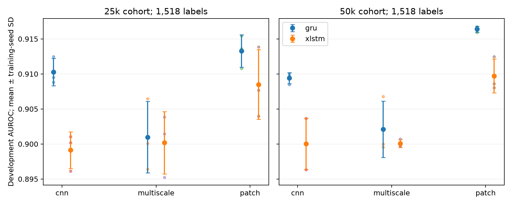

# Experiment 039: CPC encoder/context results

All 36 fresh fits completed their fixed exposure budgets and passed artifact audits.
The frozen rule identified 2 promising primary development comparisons.
The complete original factorial is reported below; all outcomes are development-only.

## Limited-label results (primary)

| Tier | Encoder | Context | 39042 | 39043 | 39044 | Mean AUROC ± seed SD | Mean AP |
| --- | --- | --- | ---: | ---: | ---: | ---: | ---: |
| 25k | cnn | gru | 0.90880 | 0.90950 | 0.91248 | 0.91026 ± 0.00195 | 0.95558 |
| 25k | cnn | xlstm | 0.90105 | 0.89614 | 0.90019 | 0.89913 ± 0.00262 | 0.94971 |
| 25k | multiscale | gru | 0.90646 | 0.90008 | 0.89640 | 0.90098 ± 0.00509 | 0.95047 |
| 25k | multiscale | xlstm | 0.90386 | 0.90145 | 0.89523 | 0.90018 ± 0.00446 | 0.94946 |
| 25k | patch | gru | 0.91360 | 0.91081 | 0.91541 | 0.91328 ± 0.00232 | 0.95759 |
| 25k | patch | xlstm | 0.91384 | 0.90767 | 0.90397 | 0.90849 ± 0.00498 | 0.95505 |
| 50k | cnn | gru | 0.90849 | 0.90970 | 0.91001 | 0.90940 ± 0.00080 | 0.95459 |
| 50k | cnn | xlstm | 0.89634 | 0.90010 | 0.90366 | 0.90003 ± 0.00366 | 0.94979 |
| 50k | multiscale | gru | 0.90676 | 0.89954 | 0.90000 | 0.90210 ± 0.00404 | 0.95121 |
| 50k | multiscale | xlstm | 0.90072 | 0.89977 | 0.89968 | 0.90006 ± 0.00058 | 0.95019 |
| 50k | patch | gru | 0.91672 | 0.91592 | 0.91655 | 0.91640 ± 0.00042 | 0.95911 |
| 50k | patch | xlstm | 0.91248 | 0.90862 | 0.90804 | 0.90971 ± 0.00241 | 0.95612 |

## Primary paired encoder comparisons

| Primary comparison | Mean ΔAUROC | Patient 95% CI | Simultaneous 95% band | Promising |
| --- | ---: | --- | --- | --- |
| 25k_limited_multiscale_minus_cnn_gru | -0.00928 | [-0.01379, -0.00503] | [-0.01750, -0.00106] | no |
| 25k_limited_multiscale_minus_cnn_xlstm | +0.00105 | [-0.00509, +0.00764] | [-0.00717, +0.00927] | no |
| 25k_limited_patch_minus_cnn_gru | +0.00302 | [-0.00277, +0.00871] | [-0.00521, +0.01124] | no |
| 25k_limited_patch_minus_cnn_xlstm | +0.00937 | [+0.00290, +0.01647] | [+0.00114, +0.01759] | yes |
| 50k_limited_multiscale_minus_cnn_gru | -0.00730 | [-0.01153, -0.00296] | [-0.01552, +0.00092] | no |
| 50k_limited_multiscale_minus_cnn_xlstm | +0.00003 | [-0.00617, +0.00609] | [-0.00819, +0.00825] | no |
| 50k_limited_patch_minus_cnn_gru | +0.00700 | [+0.00108, +0.01267] | [-0.00123, +0.01522] | no |
| 50k_limited_patch_minus_cnn_xlstm | +0.00968 | [+0.00311, +0.01593] | [+0.00146, +0.01790] | yes |

Intervals use 2,000 shared whole-patient draws, seed 39045; 0 single-class draws were skipped. The approximate simultaneous band covers eight primary contrasts with radius 0.00822.
Each draw averages per-seed AUROC differences, without forming a probability ensemble. Seed
spread is reported separately; patient intervals condition on these three trained seeds.

## Full-label results (secondary)

| Tier | Encoder | Context | 39042 | 39043 | 39044 | Mean AUROC ± seed SD | Mean AP |
| --- | --- | --- | ---: | ---: | ---: | ---: | ---: |
| 25k | cnn | gru | 0.92404 | 0.92213 | 0.92234 | 0.92284 ± 0.00105 | 0.96185 |
| 25k | cnn | xlstm | 0.91737 | 0.91467 | 0.91935 | 0.91713 ± 0.00235 | 0.95884 |
| 25k | multiscale | gru | 0.92378 | 0.91628 | 0.91390 | 0.91799 ± 0.00516 | 0.95945 |
| 25k | multiscale | xlstm | 0.91995 | 0.91928 | 0.91418 | 0.91780 ± 0.00316 | 0.95869 |
| 25k | patch | gru | 0.92834 | 0.92801 | 0.93030 | 0.92889 ± 0.00124 | 0.96497 |
| 25k | patch | xlstm | 0.92855 | 0.92601 | 0.92539 | 0.92665 ± 0.00168 | 0.96365 |
| 50k | cnn | gru | 0.92328 | 0.91988 | 0.92362 | 0.92226 ± 0.00207 | 0.96155 |
| 50k | cnn | xlstm | 0.91501 | 0.92034 | 0.92010 | 0.91848 ± 0.00301 | 0.95895 |
| 50k | multiscale | gru | 0.92375 | 0.91550 | 0.91798 | 0.91908 ± 0.00423 | 0.96004 |
| 50k | multiscale | xlstm | 0.91983 | 0.91679 | 0.91664 | 0.91775 ± 0.00180 | 0.95894 |
| 50k | patch | gru | 0.93085 | 0.92924 | 0.92920 | 0.92976 ± 0.00094 | 0.96566 |
| 50k | patch | xlstm | 0.92876 | 0.92203 | 0.92975 | 0.92685 ± 0.00420 | 0.96406 |

## Secondary context and cohort contrasts

| Comparison | Mean ΔAUROC | Paired patient 95% interval |
| --- | ---: | --- |
| 25k_full_cnn_xlstm_minus_gru | -0.00571 | [-0.01102, -0.00061] |
| 25k_full_multiscale_minus_cnn_gru | -0.00485 | [-0.00911, -0.00048] |
| 25k_full_multiscale_minus_cnn_xlstm | +0.00068 | [-0.00474, +0.00668] |
| 25k_full_multiscale_xlstm_minus_gru | -0.00019 | [-0.00583, +0.00548] |
| 25k_full_patch_minus_cnn_gru | +0.00605 | [+0.00069, +0.01147] |
| 25k_full_patch_minus_cnn_xlstm | +0.00952 | [+0.00396, +0.01554] |
| 25k_full_patch_xlstm_minus_gru | -0.00224 | [-0.00754, +0.00280] |
| 25k_limited_cnn_xlstm_minus_gru | -0.01113 | [-0.01746, -0.00491] |
| 25k_limited_multiscale_xlstm_minus_gru | -0.00080 | [-0.00715, +0.00547] |
| 25k_limited_patch_xlstm_minus_gru | -0.00478 | [-0.01176, +0.00179] |
| 50k_full_cnn_xlstm_minus_gru | -0.00378 | [-0.00914, +0.00145] |
| 50k_full_multiscale_minus_cnn_gru | -0.00318 | [-0.00739, +0.00092] |
| 50k_full_multiscale_minus_cnn_xlstm | -0.00073 | [-0.00607, +0.00462] |
| 50k_full_multiscale_xlstm_minus_gru | -0.00132 | [-0.00650, +0.00401] |
| 50k_full_patch_minus_cnn_gru | +0.00750 | [+0.00197, +0.01291] |
| 50k_full_patch_minus_cnn_xlstm | +0.00837 | [+0.00192, +0.01440] |
| 50k_full_patch_xlstm_minus_gru | -0.00291 | [-0.00847, +0.00246] |
| 50k_limited_cnn_xlstm_minus_gru | -0.00937 | [-0.01587, -0.00295] |
| 50k_limited_multiscale_xlstm_minus_gru | -0.00204 | [-0.00809, +0.00432] |
| 50k_limited_patch_xlstm_minus_gru | -0.00668 | [-0.01336, +0.00002] |
| full_cnn_gru_50k_minus_25k | -0.00058 | [-0.00354, +0.00249] |
| full_cnn_xlstm_50k_minus_25k | +0.00136 | [-0.00281, +0.00602] |
| full_multiscale_gru_50k_minus_25k | +0.00109 | [-0.00218, +0.00446] |
| full_multiscale_xlstm_50k_minus_25k | -0.00005 | [-0.00489, +0.00469] |
| full_patch_gru_50k_minus_25k | +0.00088 | [-0.00146, +0.00331] |
| full_patch_xlstm_50k_minus_25k | +0.00020 | [-0.00339, +0.00400] |
| limited_cnn_gru_50k_minus_25k | -0.00086 | [-0.00401, +0.00233] |
| limited_cnn_xlstm_50k_minus_25k | +0.00091 | [-0.00411, +0.00635] |
| limited_multiscale_gru_50k_minus_25k | +0.00112 | [-0.00217, +0.00471] |
| limited_multiscale_xlstm_50k_minus_25k | -0.00012 | [-0.00526, +0.00514] |
| limited_patch_gru_50k_minus_25k | +0.00312 | [+0.00073, +0.00554] |
| limited_patch_xlstm_50k_minus_25k | +0.00122 | [-0.00306, +0.00561] |

## Failure diagnostics and corrections

No original fit crossed the severe-development-underperformance trigger. Training-only
feature-collapse checks appear in the separate diagnostic-gate receipt.

## Execution and integrity

Both cohort tiers are v4 manifests verified byte-identical to v3; the existing immutable 038
waveform caches are reused. Historical 019 and both 038 scores were replayed exactly before
new scores. Fresh CNN arms are the matched controls. No waveform or score from calibration,
Challenge test, EchoNext test, SPH or the final frozen test was used.

Every fit used 250,000 exposures / 1,954 updates, unchanged ordinary CPC horizons, float32,
AdamW 1e-4/0.01 and clipping at 1. The readout used fixed train-only scaling/logistic C=0.01,
1,518 or 15,359 clean labels and 1,306 development ECGs from 1,173 patients. Native GRU
and the existing 038 mLSTM implementation were reused. Checkpoint recovery passed in every
real full-path profile; saved heads replayed their probabilities exactly in every audit.

| Encoder | GRU parameters | xLSTM parameters | Raw receptive field |
| --- | ---: | ---: | ---: |
| cnn | 1,237,632 | 1,279,376 | 33 samples |
| multiscale | 1,289,472 | 1,331,216 | 57 samples |
| patch | 1,088,256 | 1,130,000 | 33 samples |

## Resources

| Tier | Encoder | Seed | GRU seconds | xLSTM seconds | Projected cell seconds | GPU peak GB |
| --- | --- | ---: | ---: | ---: | ---: | ---: |
| 25k | cnn | 39042 | 211.93 | 246.64 | 1839.91 | 2.70 |
| 25k | multiscale | 39042 | 208.33 | 249.12 | 1829.23 | 3.03 |
| 25k | patch | 39042 | 156.93 | 183.60 | 1590.89 | 2.35 |
| 25k | cnn | 39043 | 189.89 | 221.40 | 1597.91 | 2.69 |
| 25k | multiscale | 39043 | 212.04 | 254.58 | 1666.56 | 3.04 |
| 25k | patch | 39043 | 160.82 | 186.71 | 1491.92 | 2.36 |
| 25k | cnn | 39044 | 188.07 | 224.16 | 1590.09 | 2.70 |
| 25k | multiscale | 39044 | 222.79 | 256.38 | 1664.05 | 3.03 |
| 25k | patch | 39044 | 165.87 | 190.83 | 1495.25 | 2.35 |
| 50k | cnn | 39042 | 193.41 | 222.82 | 1870.18 | 2.69 |
| 50k | multiscale | 39042 | 216.75 | 258.83 | 1699.47 | 3.03 |
| 50k | patch | 39042 | 167.13 | 189.37 | 1496.31 | 2.35 |
| 50k | cnn | 39043 | 193.82 | 225.76 | 1607.96 | 2.70 |
| 50k | multiscale | 39043 | 217.30 | 257.90 | 1662.81 | 3.02 |
| 50k | patch | 39043 | 165.69 | 193.79 | 1503.43 | 2.35 |
| 50k | cnn | 39044 | 192.85 | 228.66 | 1607.46 | 2.70 |
| 50k | multiscale | 39044 | 218.67 | 259.85 | 1702.65 | 3.02 |
| 50k | patch | 39044 | 167.24 | 193.34 | 1512.54 | 2.36 |

Charged new executable work before report generation: 10624.42 seconds against the 28,800-second day ceiling; stage failures are included. Historical cache
construction is disclosed in the per-cell profiles and is not charged again.

## Limits and follow-ups

These are compact concrete architecture packages with different parameter counts, one fixed
optimization recipe and three seeds. The patch arm is a local projection, not a Transformer.
The bounded multiscale support preserves CPC's future-target separation; this study does not
test unrestricted long-window encoders. Development patients were repeatedly inspected in
earlier experiments. No result establishes clinical benefit, diagnosis or a screening
operating point. Cohort scaling also changes source mix and repetitions per record.

All executed aggregate evidence, source identities, checkpoints, predictions, heads and stage
ledgers remain under `outputs/experiment039_encoder_context/`. Aggregate receipt SHA-256: `774a1dea21d7e6f7c671a9b410383a04cb278264bea2d8f8c3d9d3f3c81f4a86`. Follow-ups enter the ranked backlog; the
candidate screening pipeline and closed final test require their own decisions.

## Interpretation of the original factorial

2 of eight primary comparisons met the frozen development rule. The complete
primary table reports the matched encoder-minus-CNN differences and simultaneous bands.
The strongest observed limited-label package is patch+GRU at both tiers:
25k mean AUROC 0.91328 and
50k 0.91640. Patch+xLSTM means are
0.90849 and 0.90971, respectively.
The patch front end improves xLSTM relative to its CNN control; xLSTM does not exceed the
observed mean of the matched patch+GRU package. These development comparisons use one fixed
optimization recipe and condition on three trained seeds.

## Training-seed variation in primary differences

| Comparison | 39042 | 39043 | 39044 | Seed SD | Seed range |
| --- | ---: | ---: | ---: | ---: | --- |
| 25k_limited_multiscale_minus_cnn_gru | -0.00234 | -0.00942 | -0.01608 | 0.00687 | [-0.01608, -0.00234] |
| 25k_limited_multiscale_minus_cnn_xlstm | +0.00281 | +0.00531 | -0.00496 | 0.00535 | [-0.00496, +0.00531] |
| 25k_limited_patch_minus_cnn_gru | +0.00480 | +0.00131 | +0.00293 | 0.00175 | [+0.00131, +0.00480] |
| 25k_limited_patch_minus_cnn_xlstm | +0.01278 | +0.01153 | +0.00378 | 0.00487 | [+0.00378, +0.01278] |
| 50k_limited_multiscale_minus_cnn_gru | -0.00173 | -0.01016 | -0.01001 | 0.00482 | [-0.01016, -0.00173] |
| 50k_limited_multiscale_minus_cnn_xlstm | +0.00438 | -0.00032 | -0.00397 | 0.00419 | [-0.00397, +0.00438] |
| 50k_limited_patch_minus_cnn_gru | +0.00822 | +0.00622 | +0.00654 | 0.00108 | [+0.00622, +0.00822] |
| 50k_limited_patch_minus_cnn_xlstm | +0.01614 | +0.00852 | +0.00439 | 0.00596 | [+0.00439, +0.01614] |

## Supplementary encoder-by-context interactions

The planned exploratory interaction is the encoder-minus-CNN difference under xLSTM minus
that difference under GRU, averaged across the three seed differences. Positive values mean
the encoder-minus-CNN difference is larger under xLSTM. These comparisons do not change the
eight-comparison primary decision and do not use probability ensembles.

| Comparison | Mean interaction ΔAUROC | Seed SD | Paired patient 95% interval |
| --- | ---: | ---: | --- |
| 25k_full_multiscale_by_context | +0.00553 | 0.00429 | [-0.00128, +0.01254] |
| 25k_full_patch_by_context | +0.00348 | 0.00473 | [-0.00320, +0.01020] |
| 25k_limited_multiscale_by_context | +0.01033 | 0.00484 | [+0.00347, +0.01739] |
| 25k_limited_patch_by_context | +0.00635 | 0.00489 | [-0.00080, +0.01386] |
| 50k_full_multiscale_by_context | +0.00245 | 0.00178 | [-0.00392, +0.00894] |
| 50k_full_patch_by_context | +0.00086 | 0.00746 | [-0.00656, +0.00783] |
| 50k_limited_multiscale_by_context | +0.00733 | 0.00217 | [+0.00076, +0.01399] |
| 50k_limited_patch_by_context | +0.00269 | 0.00504 | [-0.00427, +0.00906] |

The limited-label patch interactions are +0.00635 at 25k
[-0.00080, +0.01386] and +0.00269 at 50k
[-0.00427, +0.00906]. Both exploratory intervals include zero,
so they do not establish that the patch encoder benefit differs between contexts. Multiscale
has positive limited-label interactions while its GRU differences are negative and its xLSTM
differences are near zero in the primary table; those interactions do not qualify it as an
improved encoder under the frozen primary rule.

The supplementary receipt uses 2,000 shared whole-patient draws, seed
39045; 0 draws were skipped. Its executable source and
audited cell hashes are recorded in `outputs/experiment039_encoder_context/interactions.json`.
Uncertainty conditions on the three trained seeds; these percentile intervals are exploratory.

## Completed training-health and verification checks

The training-only collapse gate checked all 36 feature matrices and returned
`passed` with 0 collapse triggers. The gate defines collapse as at least
90% of pooled coordinates having training variance below 1e-8, or nonfinite features.
`outputs/experiment039_encoder_context/diagnostic_gate.json` binds every feature archive.

The inherited per-cell `architecture_promising` and `run_50k` fields are historical helper
summaries. They did not select later cells or cohort tiers: every manifest records the
`all_encoders_seeds_tiers_unconditional` schedule, and all 36 original fits completed.

All 1,068 CPU tests passed with CUDA hidden and one compute thread. Ruff passed for the full
library, scripts and tests. The wheel and source distribution built successfully in an isolated
build environment. Two earlier build attempts failed because the runtime lacked Hatchling and
sandbox DNS prevented PyPI access; their measured elapsed time is retained in the accounting.
The validation receipt is `outputs/experiment039_encoder_context/validation.json`.

## Transformer follow-up and history provenance

The measured patch encoder is projection plus LayerNorm/GELU. A later bounded local-attention
Transformer experiment is separately authorized as Experiment 040, including a CPC/SimDINOv2
comparison; it is outside these original 36 fits and cannot replace their primary outcomes.
[PatchTST](https://arxiv.org/abs/2211.14730) supports patch-based Transformer designs for time
series, and [MTECG](https://arxiv.org/abs/2309.07136) studies masked Transformer pretraining for
ECG classification. Their objectives differ from this CPC recipe; neither establishes a CPC gain.
A local-attention front end must bound the total stacked raw receptive field and preserve
causality, independent halves and positive/negative support separation under the fixed horizons.

Git author identity was corrected by a separate metadata-only history rewrite. Scientific
source bytes and receipt files retain the original executed identities. The commit map, retained
original refs and reproduction instructions are recorded in
[Git provenance](experiment-039-git-provenance.json). The interaction implementation is separately
source-bound and uses saved predictions; it changes no original fit or primary decision.

## Final execution closure

All 18 original cells / 36 fits are complete and independently audited. The final ledger
includes the final primary bootstrap, training-only collapse checks, supplementary interactions,
report generation, CPU validation and independent executable audit. Failed package-build attempts
and the failed temporary independent-audit script attempt remain charged. That local variable
error was corrected only in the temporary validator; the scientific audit then passed.
A separate conservative 30-second allowance covers the initial untimed lint
invocation and startup outside the pytest-reported duration; it is not presented as an exact
measurement. Historical cache construction, coding/reasoning, monitoring waits and subsequent
Git metadata/publication operations are outside this new executable study charge.

Final charged executable work: 10685.80 seconds (2.968 hours), against 28,800 seconds.
The immutable closure and final ledger hashes are in
`outputs/experiment039_encoder_context/execution_closed.json`; the independent audit is
`outputs/experiment039_encoder_context/independent_audit.json`. No closed test was scored.
