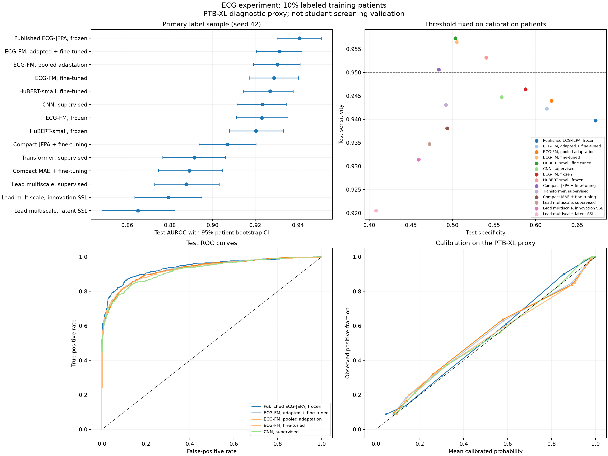

# Experiment 001 results: 10% labeled training patients

These are measured results on the PTB-XL v1.0.3 diagnostic-abnormality proxy. They do not measure disease detection or referral safety in university students. This is an exploratory study: later experimental arms were designed after inspecting earlier results, so the overall comparison was not prospectively locked.

## Data and evaluation

The primary run exposes 1,518 training ECG labels from 1,335 patients (approximately 10% of eligible training patients). All 17,418 training ECGs are available to our SSL models. The fixed evaluation set contains 1,896 ECGs from 1,653 patients, with 1,195 abnormal and 701 normal proxy labels (63.0% abnormal prevalence). Ambiguous cases are excluded: 313 from validation and 302 from test. Test coverage is 86.3% (1,896/2,198); the remaining 13.7% are outside this evaluation. Eligibility uses existing annotations and cannot be assumed available at inference. This exclusion narrows and can simplify the task. The retained test cohort has median age 64; only 105 ECGs are from people aged 18–30.

The official validation fold is split by patient: 70% for checkpoint/hyperparameter selection and 30% for logistic probability calibration and threshold selection. The operating threshold is the highest achieving at least 95% sensitivity on calibration cases. Test sensitivity is measured at that fixed threshold and need not equal 95%. The primary run uses 1,518 training, 1,306 development, 564 calibration, and 1,896 test labels: 5,284 total. Eligibility also consults the full annotation tables. This is retrospective label masking conditional on eligibility, not a prospective 10% annotation budget. All metrics are ECG-level; confidence intervals resample test patients 500 times, conditional on the fitted model and threshold. They exclude training and threshold-estimation uncertainty and domain shift.

## Primary run (label-sampling seed 42)

Rows are ordered by observed test AUROC; this is descriptive, not a claim of statistical superiority. Frozen and fine-tuned systems have different optimization and pretraining budgets.

| Model | AUROC (95% patient-cluster CI) | Average precision | Sensitivity | Specificity | Brier score |
| --- | --- | --- | --- | --- | --- |
| Published ECG-JEPA, frozen | 0.941 (0.930–0.951) | 0.969 | 94.0% | 67.2% | 0.093 |
| ECG-FM, adapted + fine-tuned | 0.931 (0.921–0.942) | 0.964 | 94.2% | 61.3% | 0.102 |
| ECG-FM, pooled adaptation | 0.930 (0.919–0.941) | 0.963 | 94.4% | 61.9% | 0.103 |
| ECG-FM, fine-tuned | 0.929 (0.917–0.940) | 0.963 | 95.6% | 50.5% | 0.104 |
| HuBERT-small, fine-tuned | 0.927 (0.915–0.938) | 0.961 | 95.7% | 50.4% | 0.105 |
| CNN, supervised | 0.923 (0.912–0.935) | 0.959 | 94.5% | 55.9% | 0.108 |
| ECG-FM, frozen | 0.923 (0.911–0.935) | 0.959 | 94.6% | 58.8% | 0.108 |
| HuBERT-small, frozen | 0.920 (0.908–0.933) | 0.956 | 95.3% | 54.1% | 0.110 |
| Compact JEPA + fine-tuning | 0.907 (0.894–0.920) | 0.948 | 95.1% | 48.4% | 0.120 |
| Transformer, supervised | 0.891 (0.877–0.906) | 0.937 | 94.3% | 49.2% | 0.130 |
| Compact MAE + fine-tuning | 0.889 (0.875–0.905) | 0.936 | 93.8% | 49.4% | 0.131 |
| Lead multiscale, supervised | 0.888 (0.873–0.903) | 0.939 | 93.5% | 47.2% | 0.132 |
| Lead multiscale, innovation SSL | 0.879 (0.864–0.895) | 0.935 | 93.1% | 45.9% | 0.137 |
| Lead multiscale, latent SSL | 0.865 (0.848–0.882) | 0.929 | 92.1% | 40.8% | 0.144 |

### Custom architecture finding

The new encoder averaged AUROC 0.8836 from scratch, 0.8610 with ordinary latent SSL, and 0.8682 with the added lead-difference target. The added objective did not outperform scratch training in this pilot. Its comparison with ordinary SSL and the exact per-seed changes are documented in [the architecture note](custom-architecture.md). This is a reported negative result, not evidence that all possible multiscale or lead-aware methods are ineffective.

## Variation across label samples

The same validation/test patients are reused. For compact SSL models, label seeds share one SSL initialization trained without labels. These repeats measure label-sampling and downstream optimization variation, not independent external validations. Standard deviations below are sample standard deviations across completed seeds.

| Model | Completed seeds | Mean AUROC ± SD | Mean sensitivity | Mean specificity |
| --- | --- | --- | --- | --- |
| CNN, supervised | 42, 43, 44 | 0.922 ± 0.002 | 95.1% | 52.6% |
| ECG-FM, frozen | 42, 43, 44 | 0.923 ± 0.001 | 94.2% | 58.5% |
| Published ECG-JEPA, frozen | 42, 43, 44 | 0.942 ± 0.003 | 93.5% | 70.6% |
| HuBERT-small, frozen | 42, 43, 44 | 0.919 ± 0.003 | 94.7% | 56.5% |
| Compact JEPA + fine-tuning | 42, 43, 44 | 0.905 ± 0.004 | 95.0% | 48.5% |
| Lead multiscale, innovation SSL | 42, 43, 44 | 0.868 ± 0.010 | 94.1% | 41.3% |
| Lead multiscale, latent SSL | 42, 43, 44 | 0.861 ± 0.006 | 93.1% | 36.9% |
| Lead multiscale, supervised | 42, 43, 44 | 0.884 ± 0.006 | 92.6% | 48.6% |
| Compact MAE + fine-tuning | 42, 43, 44 | 0.884 ± 0.007 | 93.9% | 48.0% |
| Transformer, supervised | 42, 43, 44 | 0.897 ± 0.005 | 94.6% | 48.5% |

### Paired adaptation comparisons

500 paired resamples of test patients, retaining every ECG in a sampled patient; percentile intervals conditional on the fitted models. ECG IDs, patient IDs, and targets are aligned and verified. Single-class draws are omitted. Exploratory contrasts, no multiplicity adjustment.

| Adapted model minus reference | AUROC difference | 95% patient-cluster interval |
| --- | ---: | --- |
| ECG-FM, adapted + fine-tuned minus ECG-FM, fine-tuned | +0.0026 | [-0.0031, +0.0081] |
| ECG-FM, pooled adaptation minus ECG-FM, fine-tuned | +0.0016 | [-0.0046, +0.0076] |
| ECG-FM, pooled adaptation minus ECG-FM, adapted + fine-tuned | -0.0010 | [-0.0024, +0.0003] |

## Using all eligible public training labels

Following the expanded project brief, these runs expose all 15,360 eligible PTB-XL training ECG labels from 13,352 patients. Development, calibration, test cases, and evaluation procedures remain the same. This uses public labels fully; it does not assume that university labels are available. Results are single-seed exploratory comparisons.

| Model | Training labels | AUROC | Sensitivity | Specificity |
| --- | ---: | ---: | ---: | ---: |
| Published ECG-JEPA, frozen | 15,360 | 0.9545 | 95.2% | 71.8% |
| CNN, supervised | 15,360 | 0.9435 | 96.2% | 59.1% |
| ECG-FM, frozen | 15,360 | 0.9345 | 93.5% | 67.0% |

## Hypothetical low-prevalence screening

The following arithmetic assumes 1% prevalence and unchanged sensitivity/specificity. Neither assumption has been established in students. The 1% prevalence scenario is unrelated to the original 1% annotation rate. AUPRC, precision, calibration, and referral volume measured on PTB-XL cannot be transferred directly to that population.

| Model (seed 42) | True positives / 1,000 | False positives / 1,000 | Misses / 1,000 | Positive predictive value |
| --- | --- | --- | --- | --- |
| Published ECG-JEPA, frozen | 9.4 | 324.8 | 0.6 | 2.8% |
| ECG-FM, adapted + fine-tuned | 9.4 | 382.7 | 0.6 | 2.4% |
| ECG-FM, pooled adaptation | 9.4 | 377.1 | 0.6 | 2.4% |
| ECG-FM, fine-tuned | 9.6 | 490.1 | 0.4 | 1.9% |
| HuBERT-small, fine-tuned | 9.6 | 491.5 | 0.4 | 1.9% |
| CNN, supervised | 9.4 | 436.4 | 0.6 | 2.1% |
| ECG-FM, frozen | 9.5 | 408.1 | 0.5 | 2.3% |
| HuBERT-small, frozen | 9.5 | 454.8 | 0.5 | 2.1% |
| Compact JEPA + fine-tuning | 9.5 | 511.2 | 0.5 | 1.8% |
| Transformer, supervised | 9.4 | 502.8 | 0.6 | 1.8% |
| Compact MAE + fine-tuning | 9.4 | 501.4 | 0.6 | 1.8% |
| Lead multiscale, supervised | 9.3 | 522.5 | 0.7 | 1.8% |
| Lead multiscale, innovation SSL | 9.3 | 535.2 | 0.7 | 1.7% |
| Lead multiscale, latent SSL | 9.2 | 586.1 | 0.8 | 1.5% |

## Methods and limits

- Compact models use all 12 leads at 100 Hz for 10 seconds, with training-only lead RMS scaling. The transformer has three 96-dimensional layers and 250 ms patches. MAE learns masked waveform reconstruction; the JEPA-inspired model predicts EMA-teacher latent targets and applies a variance penalty. Both receive 50 SSL epochs on training waveforms only, then the same downstream optimizer as the supervised transformer. They are our small experimental implementations, not reproductions of published ST-MEM or ECG-JEPA.
- Published encoders retain their own preprocessing and representations. HuBERT and ECG-FM aggregate two five-second views; source revisions, checkpoint hashes, and preprocessing are stored with embeddings and model configs. The HuBERT and ECG-FM public SSL checkpoints previously encountered PTB-XL waveforms, so those results are not an unseen-waveform external test. We use SSL-only checkpoints rather than supervised Cardio-Learning weights.
- Additional ECG-FM adaptation is a bounded pilot using a CMSC-style temporal contrastive objective, not a reproduction of its complete pretraining loss. Both arms use one pass through their training pools, chosen from runtime profiling before downstream evaluation; this is not a test of extensively optimized continued pretraining. Adaptation checkpoints and their exact waveform sources are recorded under `outputs/experiment001/`. A pooled arm, where present, adds a verified Georgia pilot subset without using its diagnoses. Georgia was already represented in the released encoder's historical pretraining data. Matching the two five-second views can suppress transient findings present in only one half, so this objective is a hypothesis to evaluate.
- The custom eight-lead multiscale encoder has matched scratch, ordinary latent-prediction, and added lead-difference-prediction arms. It is a custom hypothesis with unverified novelty. Its two SSL arms use the same 20-epoch budget, chosen from timing measurements before downstream evaluation. See [the design note](custom-architecture.md) for masking, target construction, related work, and the primary ablation.
- Published ECG-JEPA uses the authors' eight-lead, 250 Hz preprocessing and frozen encoder. Its repository lists Shaoxing/CODE15 pretraining commands; the exact released checkpoint's complete data provenance has not been independently verified. It is not established here as a completely unexposed external-test control.
- All pretrained systems have different historical datasets and compute budgets. These measurements compare practical systems; they do not isolate architecture from pretraining scale.
- Calibration and the illustrative 95% sensitivity target are research choices. The resulting probabilities concern the proxy label in this evaluation population, not confirmed heart disease or a validated clinical referral probability. Local expert-reviewed data remain necessary.

The original 1% training-label regime has not been tested. The additional fully labeled public-data runs are reported separately; the study does not establish prospective local annotation savings.

## Artifacts

Detailed metrics, patient bootstrap intervals, test probabilities, model weights, configs, and training histories are under `outputs/experiment001/`. Raw waveforms and predictions are git-ignored; this summary and figure are shareable repository artifacts.

